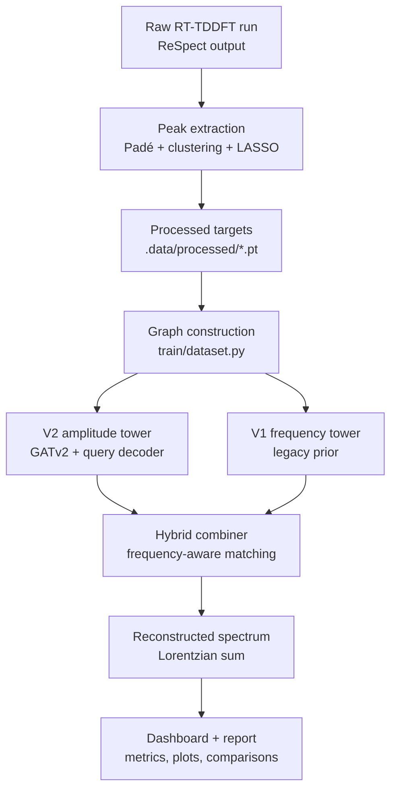
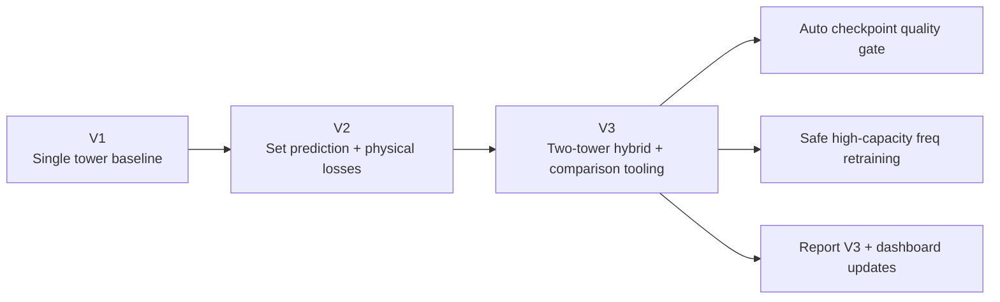
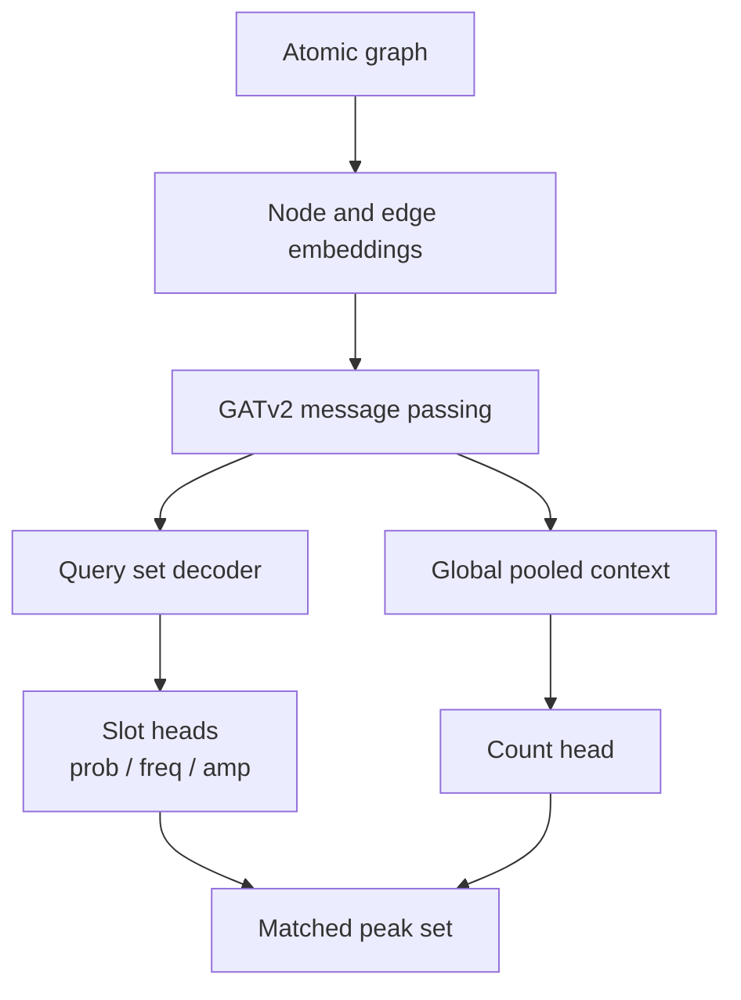
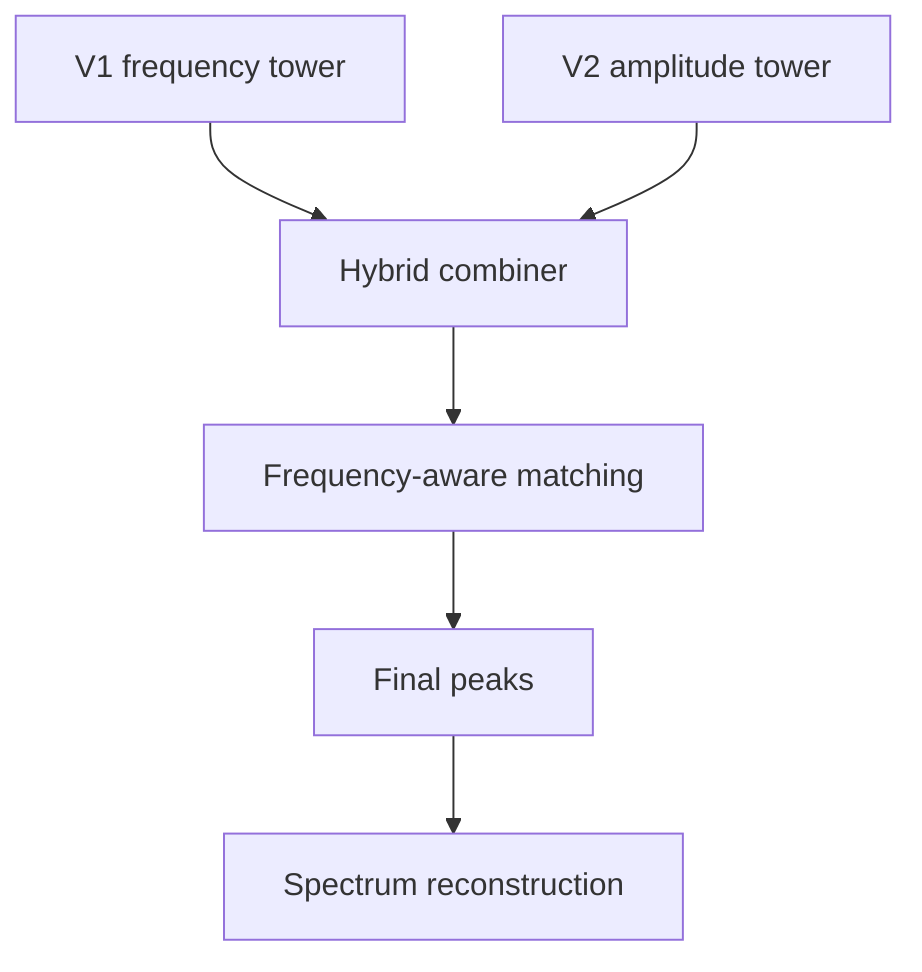
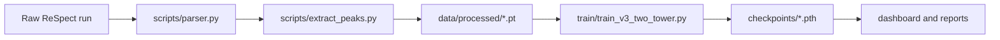
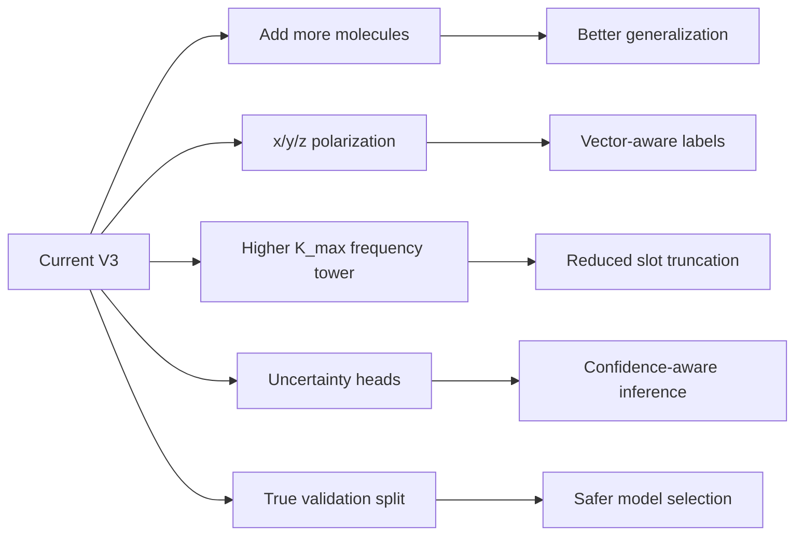

# Electron-GNN


ML-Accelerated Quantum Spectroscopy via Graph Neural Networks.

This repository predicts absorption spectra from molecular geometry using RT-TDDFT peak extraction, graph neural networks, and a two-tower hybrid inference stack.

## Current State

- V1: simple fixed-slot spectral predictor.
- V2: set-prediction model with GATv2 encoder, query decoder, count head, and Hungarian matching.
- V3: two-tower hybrid workflow with a frequency prior tower, amplitude tower, checkpoint quality gating, and dashboard comparison mode.

Current operational default:
- V3 hybrid inference.
- Automatic fallback to the strongest amplitude checkpoint.
- V4 is archived as a failed experiment and removed from the active dashboard workflow.

## End-To-End Pipeline



## Version History



| Version | Main Idea | Status |
|---|---|---|
| V1 | Simple fixed-slot spectral predictor | Historical baseline |
| V2 | GATv2 encoder + query decoder + count head | Reference architecture |
| V3 | Hybrid frequency prior + amplitude tower + quality gate | Current default |

Git tags:
- `v2` points to the V2 single-tower baseline.
- `v3` points to the current V3 two-tower hybrid state.

## Architecture

The model learns unordered transition sets rather than a dense spectrum directly.

### V2 / V3 Model Flow



### Hybrid Inference Flow



  V3 hybrid now supports amplitude-guided overflow frequency slots so predictions are not artificially capped by legacy V1 slot capacity.

## Why This Structure

- Frequencies are easier to learn with a strong prior from the legacy V1 tower.
- Amplitudes are more sensitive to calibration and benefit from the V2 set decoder and log-scale supervision.
- Hybrid inference separates concerns: one tower specializes in peak locations, the other in amplitudes and cardinality.
- This was necessary because the current dataset is tiny and amplitude quality is otherwise unstable.

## Current Dataset

- Processed molecules: 2
- Targets:
  - ammonia: 39 peaks
  - water: 55 peaks
- Current bottleneck: data volume and chemistry diversity, not execution tooling.

## Results Snapshot

Latest stable evaluation baseline:

| Molecule | Model | Freq MAE | Amp MAE | Overlap | Pred Peaks | True Peaks |
|---|---|---:|---:|---:|---:|---:|
| ammonia | V1 | 0.03000 | 1.947729e-03 | 0.5240 | 41 | 39 |
| ammonia | V2 | 0.71727 | 1.083328e-04 | 0.5434 | 39 | 39 |
| ammonia | Hybrid | 0.03560 | 1.419743e-04 | 0.6472 | 39 | 39 |
| water | V1 | 0.04456 | 2.305660e-03 | 0.4510 | 41 | 55 |
| water | V2 | 0.32185 | 6.498991e-05 | 0.5311 | 56 | 55 |
| water | Hybrid | 0.22634 | 9.328221e-05 | 0.4924 | 56 | 55 |

Takeaways:
- V1 remains the strongest frequency prior on the tiny dataset.
- V2 remains the best amplitude learner in direct amplitude MAE.
- Hybrid gives the best overlap with the baseline amp checkpoint and overflow-enabled decode.
- Fresh retraining on this tiny dataset did not beat the baseline amp checkpoint, so production keeps `checkpoints/best_model.pth` for the amp tower.

## Dashboard

Run the dashboard with:

```bash
streamlit run dashboard/app.py
```

Dashboard sections (cleaned up with a minimalist vintage UI):
- Overview
- Data
- Training
- Inference
- Diagnostics
- 3D Visualizer

What changed in the overhaul:
- Cleaner layout and typography with a consistent visual system.
- Less conflicting controls and clearer section boundaries.
- Richer data insights (distribution histograms, per-sample peak inspection, summary table).
- Better training monitor with selectable log source and V2/V3-aware parsing.
- Better inference studio with V1/V2/V3 comparison metrics and plots.

Auto-update behavior:
- Sidebar has `Auto-refresh data/logs` and configurable refresh interval.
- Data and training views are cache-busted by file signatures + short TTL, so updates appear automatically when files change.
- Training monitor reads the newest log source (`results/train_output.log` or `results/v3_train_output.log`).

## Training And Evaluation

Train the current V3 workflow:

```bash
/home/user/Electron-GNN/EGNN/bin/python -m train.train_v3_two_tower \
  --data_dir data/processed \
  --epochs_freq 0 \
  --epochs_amp 80 \
  --batch_size 1 \
  --val_ratio 0.5 \
  --amp_early_stop_patience 12 \
  --save_dir checkpoints \
  --log_file results/v3_train_output.log \
  --init_freq_ckpt checkpoints/best_model_v1.pth \
  --init_amp_ckpt checkpoints/best_model.pth
```

Evaluate V1 vs V2 vs Hybrid:

```bash
/home/user/Electron-GNN/EGNN/bin/python scripts/evaluate_two_tower.py \
  --data_dir data/processed \
  --v1_ckpt checkpoints/best_model_v1.pth \
  --v2_ckpt checkpoints/best_model.pth \
  --prob_threshold 0.65 \
  --fallback_topk 8 \
  --hybrid_min_freq_separation 0.005
```

The stable evaluation command intentionally uses `best_model.pth` for the amplitude tower because the newer `v3_amp_tower.pth` can underperform on this small dataset.

Latest retrain benchmark artifact:
- `results/v3_retrain_eval_summary.txt`

If you need strict legacy behavior without overflow slots:

```bash
/home/user/Electron-GNN/EGNN/bin/python scripts/evaluate_two_tower.py \
  --data_dir data/processed \
  --v1_ckpt checkpoints/best_model_v1.pth \
  --v2_ckpt checkpoints/best_model.pth \
  --prob_threshold 0.65 \
  --fallback_topk 8 \
  --disable_hybrid_amp_overflow
```

## Reports And Documentation

- Current authoritative V3 report: [docs/REPORT_V3_TWO_TOWER_HYBRID.md](docs/REPORT_V3_TWO_TOWER_HYBRID.md)
- Detailed V3 end-to-end pipeline report with equations: [docs/REPORT_V3_END_TO_END_PIPELINE_DETAILED.md](docs/REPORT_V3_END_TO_END_PIPELINE_DETAILED.md)
- V2 architecture report: [docs/REPORT_V2_ARCHITECTURE_AND_SCALING.md](docs/REPORT_V2_ARCHITECTURE_AND_SCALING.md)
- Data generation playbook: [docs/PROFESSOR_REQUESTS_AND_DATA_GENERATION.md](docs/PROFESSOR_REQUESTS_AND_DATA_GENERATION.md)

## Repository Layout

```text
.
├── data/                  # raw RT-TDDFT output and processed peak targets
├── dashboard/             # Streamlit interface
├── docs/                  # theory, V2/V3 reports, playbooks
├── models/                # V1 and V2/V3 model definitions
├── scripts/               # extraction, evaluation, plotting utilities
├── train/                 # dataset, losses, training scripts
├── utils/                 # plotting, diagnostics, hybrid inference
└── results/               # logs and generated plots
```

## Data Generation Flow



## Key Constraints

- The dataset is still too small for robust amplitude generalization.
- Frequency retraining at high K_max must be guarded with warmup freezing, teacher regularization, and early stopping.
- The hybrid stack should always be validated against the current report and dashboard comparison panel before checkpoint promotion.

## Archived Experiments

V4 verifier/refiner code remains in the repository for reference only.

Archive location:
- `archive/v4_failed_experiment/`
- index: `archive/v4_failed_experiment/README.md`

- It is not part of the active dashboard mode list.
- It is not used in current model selection.
- The production path is V3 hybrid training and inference.

## Extension Scope



## Status

The repository is currently set up for:

- peak extraction from RT-TDDFT logs,
- graph construction from molecular structure,
- V2 amplitude prediction,
- V3 hybrid inference,
- dashboard comparison and diagnostics,
- report generation and versioned release tracking.

The next bottleneck is dataset scaling, not framework completeness.