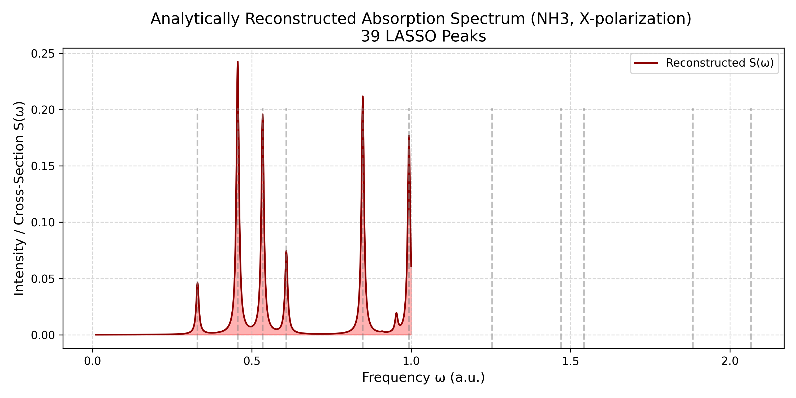
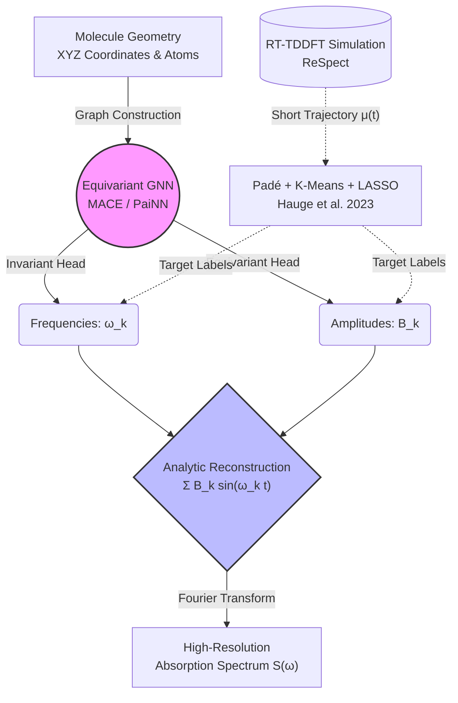

# ML-Accelerated Quantum Spectroscopy via GNNs


## Architecture Overview
The theoretical foundation of this work couples **geometric deep learning** with the **Fourier-Padé extraction** methodology introduced by Hauge et al. (2023) to perfectly map a static molecule to its time-dependent quantum response, reducing simulation times from minutes/hours to milliseconds.


*(Ground Truth Absorption Spectrum for $NH_3$ reconstructed analytically from the extracted Padé+LASSO Target Peaks.)*

## End-to-End Pipeline



## Abstract
Traditional RT-TDDFT calculates the exact time-dependent electron density $\rho(r, t)$ after a Dirac-delta electric field perturbation. This yields the induced dipole moment $\mu(t)$, which is Fourier-transformed to obtain the absorption spectrum. However, doing this at high resolutions requires thousands of time steps. 

This project trains a neural network to bypass this step entirely. We use the methodology of Hauge et al. to extract the exact transition frequencies ($\omega_k$) and dipole amplitudes ($B_k$) from short RT-TDDFT runs to serve as ground-truth training data. We then train an $E(3)$-equivariant GNN to predict these parameter sets from the ground state molecular graph, utilizing a Bipartite Matching Loss (Hungarian algorithm) to handle permutation invariance and varying cluster sizes.

## Repository Structure (Planned)
```text
.
├── data/                  # ReSpect TDDFT structural/output data
├── docs/                  # Detailed theory and mathematical design
├── scripts/
│   ├── parser.py          # Extracts μ(t) from ammonia_x.out
│   └── extract_peaks.py   # HyQD Padé + LASSO pipeline to generate {ω, B} targets
├── utils/                 # Utilities for visualization, plotting, and analysis
│   ├── plot_spectrum.py   # Reconstructs and plots S(ω) from predicted peaks
│   ├── plot_molecule.py   # 3D molecular visualization utilities
│   └── signal_utils.py    # Fourier transforms and smoothing for μ(t)
├── dashboard/             # Interactive Streamlit Data, Training, & Inference UI
│   └── app.py             # Main dashboard rendering pipeline overview metrics
├── models/                # PyTorch Geometric models (MACE / PaiNN implementations)
├── train/                 # Training loops, Bipartite matching losses
└── README.md
```

## Quick Start (Coming Soon)
To launch the interactive monitoring dashboard tracking pipeline progress:
```bash
pip install streamlit matplotlib numpy
streamlit run dashboard/app.py
```

## References
1. **Hauge, E. et al. (2023)**. "Cost-Efficient High-Resolution Linear Absorption Spectra through Extrapolating the Dipole Moment from Real-Time Time-Dependent Electronic-Structure Theory." *J. Chem. Theory Comput.*
2. **Batatia, I. et al. (2022)**. "MACE: Higher Order Equivariant Message Passing Neural Networks for Fast and Accurate Force Fields." *arXiv*.
3. **Schütt, K. T. et al. (2021)**. "Equivariant message passing for the prediction of tensorial properties and molecular spectra" (PaiNN). *ICML*.