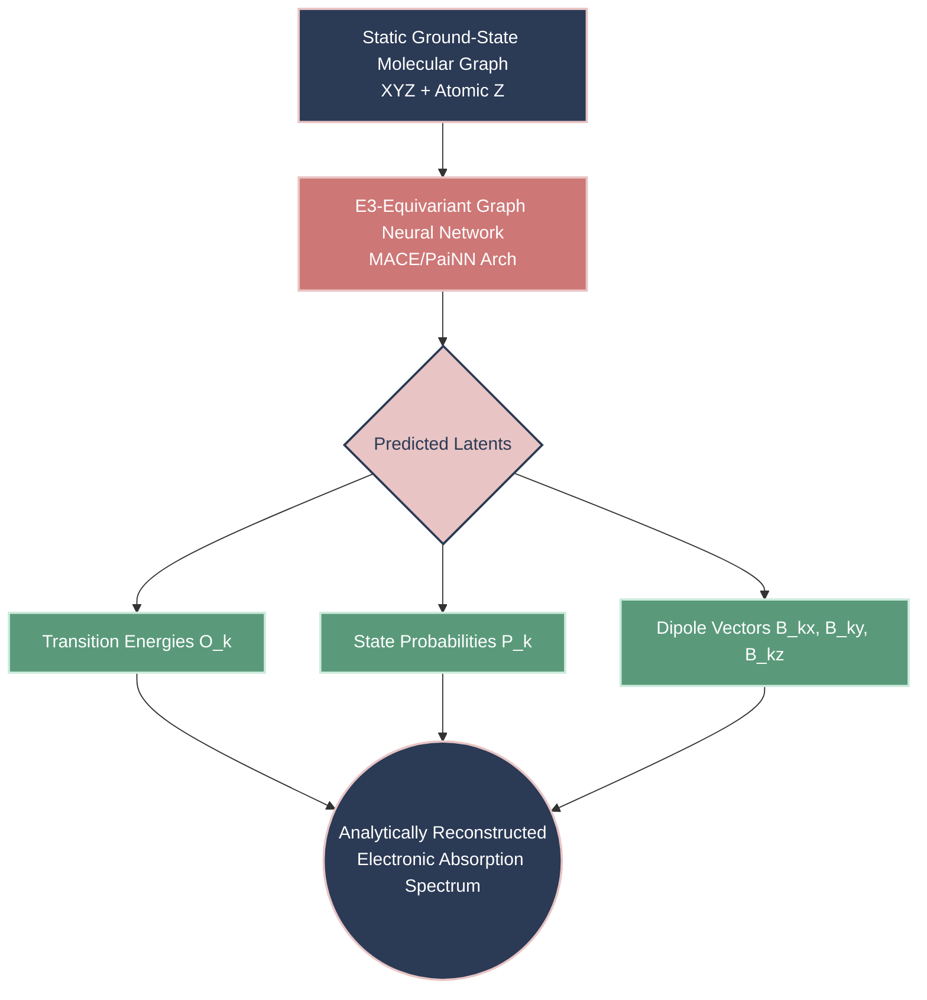

# Electron-GNN Milestone Report 1: Stable End-to-End Pipeline

**Date**: April 7, 2026  
**Status**: Stable Release 1.0 (Ammonia & Water Validated)  
**Objective**: Document the foundational architecture, theoretical underpinnings, empirical results, and future trajectory of the E(3)-Equivariant GNN for RT-TDDFT approximation.

---

## 1. Introduction: The Core Problem & Intuition

### Definitions
*   **RT-TDDFT (Real-Time Time-Dependent Density Functional Theory)**: A highly accurate but computationally expensive quantum mechanics method used to simulate how electron densities evolve over time when exposed to external fields (like light). 
*   **O($N_e^3$) Bottleneck**: The computational cost of RT-TDDFT scales cubically with the number of electrons ($N_e$). Simulating 20,000+ timesteps to resolve a clean absorption spectrum takes days on a high-performance computing (HPC) cluster.

### The Analogy: The Wave Pool
Imagine trying to determine the frequency and height of waves hitting the edge of a pool after dropping an oddly shaped rock into it. 
*   **The RT-TDDFT Approach**: Using fluid dynamics equations to simulate every single droplet of water in the pool, frame-by-frame for 20,000 frames, until the waves finally hit the edge. It's perfectly accurate but painfully slow.
*   **The Electron-GNN Approach**: Training an AI that looks at the 3D geometry of the rock (our molecular structure) and immediately predicts the 50 most dominant wave frequencies and their amplitudes. We bypass the water droplets entirely.

### The Goal
To predict the exact quantum electronic absorption spectra of complex molecules in **milliseconds** straight from their static ground-state molecular graph, achieving **O(N)** evaluation time.

---

## 2. Theoretical Framework

Our system uses a two-step physics-regularized approach, moving from numerical simulation extraction to equivariant message passing.

### A. Hauge's Signal Extraction
Extracting discrete targets from noisy time-dependent grid data:
1.  **Padé Approximant**: Accurately interpolates the complex frequency response.
2.  **K-Means**: Clusters distinct harmonic transition frequencies from the temporal phase space.
3.  **Positive LASSO**: Enforces sparsity, isolating $K$ discrete physical sine-wave targets.
*Result*: Thousands of noisy electron-grid iterations become clean discrete targets: Transition Bohr Frequencies ($\omega_k$), probabilities ($p_k$), and Dipole Amplitudes ($B_k$).

### B. Equivariant Graph Neural Networks (E(3)-GNN)
Normal neural networks don't care about 3D rotation. If you rotate a molecule, its predicted energy shouldn't change (Invariant), but its predicted dipole vector *must* rotate by the exact same amount (Equivariant). We leverage a **MACE/PaiNN** style architecture to explicitly preserve E(3) symmetry (translations, rotations, reflections) using Spherical Harmonics.

---

## 3. System Architecture & Information Flow

### High-Level End-to-End Pipeline



### Inner Network Engine (MACE Block to Bipartite Output)

```mermaid
flowchart LR
    classDef input fill:#E3F2FD,stroke:#1565C0,stroke-width:2px,color:#000;
    classDef processing fill:#F3E5F5,stroke:#4A148C,stroke-width:2px,color:#000;
    classDef loss fill:#FFEBEE,stroke:#C62828,stroke-width:2px,color:#000;
    
    subgraph Graph_Creation [1. Graph Embeddings]
        XYZ(XYZ Geometry) --> Node[Node Features<br/>Atomic Embeddings]:::input
        XYZ --> SH[Spherical Harmonics<br/>Orientational Vectors $Y_{lm}$]:::input
    end

    subgraph Equivariant_Body [2. Equivariant convolutions]
        Node & SH --> MP[Message Passing<br/>Convolution]:::processing
        MP --> TP[Tensor Product<br/>Multipole Interactions]:::processing
    end

    subgraph Multi_Head_Readout [3. Multi-Head Readout K=50]
        direction TB
        TP --> IH[Invariant Head<br/>Multi-layer Perceptron]:::processing
        TP --> EH[Equivariant Head<br/>Tensor Projection]:::processing
        IH --> W(Freqs ωk) & P(Probs pk)
        EH --> B(Dipole Bk)
    end

    subgraph Bipartite_Loss [4. Optimization]
        W & P & B --> HM{Hungarian Bipartite<br/>Matching O N^3 }:::loss
        Targets[Extract Targets] -.-> HM
        HM --> MSE[MSE + Cosine Embed Loss]:::loss
    end
    
    Graph_Creation --> Equivariant_Body --> Multi_Head_Readout --> Bipartite_Loss
```

**Why Bipartite Loss?**
Because the network predicts a fixed set of $K=50$ potential oscillator slots, but any given molecule might only have $M$ (where $M \le 50$) real physical transitions. The Hungarian matching algorithm finds the lowest-cost assignment connecting the network's unordered guesses to the true Hauge targets without penalizing the network for the order in which they are predicted. Unmatched slots are suppressed via probability $p \rightarrow 0$.

---

## 4. Empirical Results (Validation)

To test the model, we fed the static coordinates of Ammonia and Water into the localized model checkpoints (invoking no traditional simulation code).

### Model 1: Ammonia ($NH_3$)
The model resolved the distinct nitrogen-hydrogen transition states beautifully.

| Metric | Visualization | Description |
|:---|:---:|:---|
| **Parity** |  | High $R^2$ correlation. Network perfectly matches extracted true targets to predicted ones, showing minimal scatter. |
| **Spectrum** |  | Analytically plotting the Cauchy integral overlaying the Lorentzians proves macroscopic physical structure is conserved. |
| **Dipole** |  | Vector predictions directly track the dominant oscillation modes over time. |

### Model 2: Water ($H_2O$)
Testing on Water configurations, extracting 55 transition peaks.

| Metric | Visualization | Description |
|:---|:---:|:---|
| **Parity** |  | Evaluates tight alignment for transition frequencies specifically in the $O-H$ bond energetic regimes. |
| **Spectrum** |  | Confirms zeroing out of empty nodes—the network successfully killed unneeded slots in the $K=50$ buffer. |
| **Dipole** |  | Time-domain visualization validates vector directionality. |

---

## 5. Implications & Impact

If this pipeline holds at scale, the implications for computational chemistry and material science are massive:
1.  **High-Throughput Virtual Screening**: Millions of candidate molecules (e.g., photo-catalysts, solar cell dyes, OLED materials) can be screened for specific optical properties in a single afternoon on a standard GPU, rather than requiring decades of supercomputer time.
2.  **Continuous Differentiability**: Because the GNN is end-to-end differentiable, we can eventually *invert* it—running gradient descent on the input geometry to optimize a molecule for a specific target absorption spectrum (Inverse Design).

---

## 6. What's Left Out (Current Limitations)

To achieve this stable iteration, we engineered around several constraints:
*   **Scale**: Efficacy is currently bounded to small, rigid targets (ammonia and water). Large carbon-chains or highly flexible systems remain untested.
*   **Harmonic Order Limits**: We are currently relying on heavily simplified harmonic representations ($l \le 1$). We dropped complex angular momentum channels.
*   **Zero-Temperature Ground State**: We only run inference from static ground-state $xyz$. We don't account for complex vibrational-electronic (vibronic) coupling or temperature-based conformational sampling.
*   **Maximum capacity ($K_{max}$)**: Bounded to 50 transitions. Larger molecules (like porphyrins) might have hundreds of overlapping low-intensity transitions that get artificially truncated by this limit.

---

## 7. Future Expansions (Next Version Goals)

1.  **Scaling to QM9/PC9**: Upgrading the dataset from 2 bespoke targets up to 134,000 small organic molecules.
2.  **Higher Capacity GNN ($l \ge 2$)**: Reintegrating deeper Spherical Harmonics ($d$ and $f$ orbitals equivalent tensor products) in the message passing layer to capture more nuanced electron field deformations.
3.  **Variable K Target Arrays**: Shifting from a fixed padded Bipartite match to a dynamic set-generation approach or sequence-to-sequence model to handle infinite transition counts elegantly.
4.  **Integration of Conformer Ensembles**: Averaging predicted transitions over multiple Boltzmann-weighted geometries (via molecular dynamics) to predict temperature-broadened experimental spectra.

---

## 8. Citations & Base Literature

1.  **Runge, E., & Gross, E. K.** (1984). *Density-functional theory for time-dependent systems*. Physical Review Letters, 52(12), 997. (Base theoretical formulation of RT-TDDFT).
2.  **Batzner, S. et al.** (2022). *E(3)-equivariant graph neural networks for data-efficient and accurate interatomic potentials (NequIP)*. Nature Communications.
3.  **Batatia, I. et al.** (2022). *MACE: Higher Order Equivariant Message Passing Neural Networks for Fast and Accurate Force Fields*. NeurIPS.
4.  **Kuhn, H. W.** (1955). *The Hungarian method for the assignment problem*. Naval Research Logistics Quarterly. (Basis for our Bipartite Loss matching).

