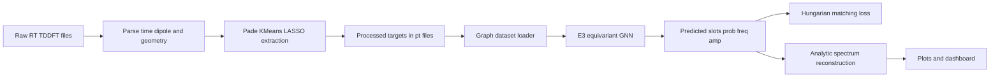
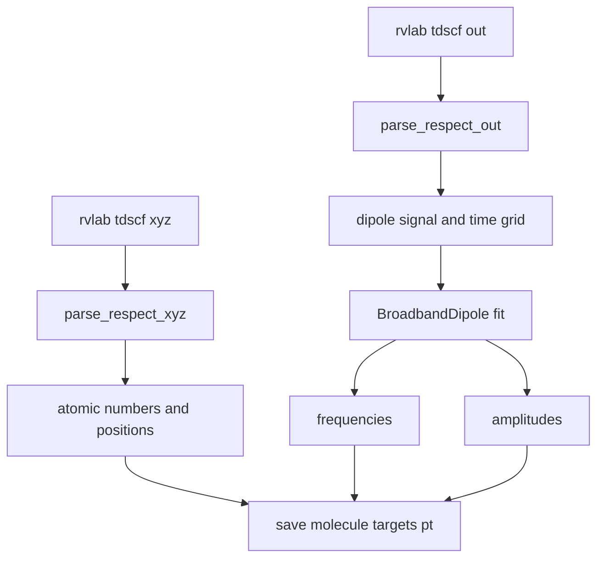
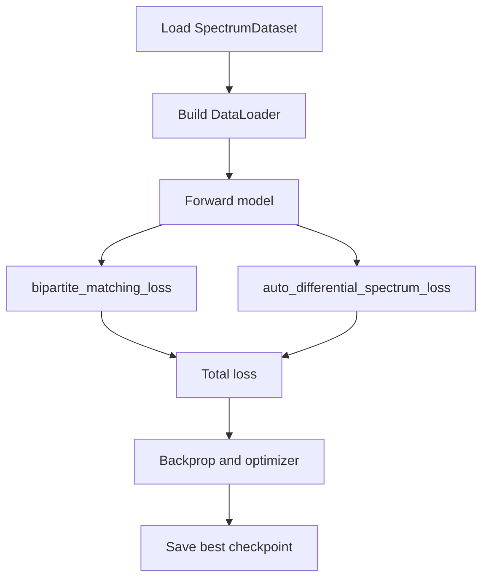
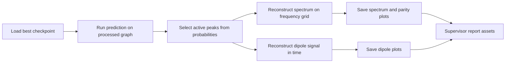

# Electron-GNN Stable Milestone Report 1

Date: April 7, 2026
Release tag: Stable v1 (ammonia + water validated)
Audience: New team member with zero prior knowledge
Purpose: Explain what this project is, why it matters, and how to rebuild the full pipeline from scratch.

---

## 0. What This Report Gives You

This report is intentionally written as a complete restart guide. If you hand this file to a new person, they should be able to:

1. Understand the scientific motivation.
2. Understand the machine learning architecture choices.
3. Reproduce data extraction from raw RT-TDDFT output.
4. Rebuild the graph dataset.
5. Train the model.
6. Recreate all evaluation plots.
7. Run the Streamlit dashboard.
8. Understand limitations and next expansions.

---

## 1. Motivation, With a Real-World Analogy

### 1.1 The Practical Problem

RT-TDDFT gives high-quality spectra, but it is expensive. To get sharp spectral resolution, you need long simulations with many timesteps. Cost grows quickly with system size.

In simplified complexity terms:

$$
Traditional RT-TDDFT cost \sim O(N_e^3)
$$

where $N_e$ is the number of electrons.

### 1.2 Why This Project Exists

Instead of simulating long electron-density trajectories every time, we train a model that maps directly from static molecular geometry to spectral parameters.

### 1.3 Analogy: Orchestra vs Full Physics Engine

Imagine you want to recreate a song.

1. The expensive method: simulate every vibration of every violin string in air over time.
2. The efficient method: identify the musical notes and volumes, then reconstruct the song from those notes.

This project does the second option for molecules:

1. Extract spectral note list once from physics (frequencies + amplitudes).
2. Train GNN to predict that note list from geometry.
3. Reconstruct the full spectrum analytically.

---

## 2. Zero-Knowledge Glossary

RT-TDDFT:
Real-time time-dependent density functional theory. Accurate quantum simulation of electron response after a perturbation.

Dipole signal:
A time-domain response signal, usually written as mu(t). Encodes absorption behavior in time.

Frequency-domain spectrum:
The absorption curve obtained after transforming time signal information to frequency space.

Pade approximant:
A rational approximation that can recover frequencies from shorter time signals better than naive FFT in some settings.

LASSO:
Sparse regression that keeps only important peaks.

E(3)-equivariant GNN:
A graph model that handles 3D geometry in a physically consistent way under rotations/translations.

Hungarian matching:
Algorithm for optimal assignment between predicted peaks and true peaks when ordering is arbitrary.

---

## 3. End-to-End Architecture

### 3.1 One-Page Pipeline



### 3.2 Data Extraction Subsystem



### 3.3 Training Loop Subsystem



### 3.4 Inference and Reporting Subsystem



---

## 4. Exact Project Structure You Need

```text
electron-gnn/
  checkpoints/
    best_model.pth
  data/
    raw/
      ammonia_x/
      water_x/
    processed/
      ammonia_targets.pt
      water_targets.pt
  dashboard/
    app.py
  models/
    mace_net.py
    molecule_graph.py
  scripts/
    parser.py
    extract_peaks.py
    generate_report_plots.py
  train/
    dataset.py
    losses.py
    train.py
  docs/assets/report/
    parity_ammonia.png
    parity_water.png
    spectrum_ammonia.png
    spectrum_water.png
    dipole_ammonia.png
    dipole_water.png
  REPORTS/
    report_1.md
```

---

## 5. Rebuild From Scratch: Step-by-Step

### 5.1 Prerequisites

1. Python 3.10+ (project currently running in a local virtual environment).
2. Access to GPU is optional but recommended.
3. Raw RT-TDDFT folders under data/raw.

### 5.2 Environment Setup

```bash
python -m venv .venv
source .venv/bin/activate
pip install -r requirements.txt
```

Current requirements include:

1. torch
2. torch_geometric
3. e3nn
4. numpy
5. scipy
6. matplotlib
7. streamlit
8. pandas
9. scikit-learn
10. plotly

### 5.3 Raw Data Format

Each molecule folder is expected to contain at least:

1. One .out file with Step EAS lines.
2. One .xyz file with atoms and grid metadata.
3. Optional rho frame files for volumetric visualization.

Example layout:

```text
data/raw/ammonia_x/
  rvlab.tdscf.out
  rvlab.tdscf.xyz
  rvlab.tdscf.rho.00000
  rvlab.tdscf.rho.00005
  ...
```

### 5.4 Parse Raw Output to Signals

Core extraction logic in scripts/parser.py:

```python
def parse_respect_out(filepath):
    times = []
    dipole_x, dipole_y, dipole_z = [], [], []
    with open(filepath, 'r') as f:
        for line in f:
            if "Step EAS:" in line:
                parts = line.strip().split()
                time_val = float(parts[3])
                x_val = float(parts[5])
                y_val = float(parts[6])
                z_val = float(parts[7])
                times.append(time_val)
                dipole_x.append(x_val)
                dipole_y.append(y_val)
                dipole_z.append(z_val)
    return np.array(times), np.array(dipole_x), np.array(dipole_y), np.array(dipole_z)
```

This turns simulation logs into clean time-series arrays.

### 5.5 Convert Signals to Learning Targets

Core target extraction in scripts/extract_peaks.py:

```python
extractor = BroadbandDipole(cutoff_frequency=cutoff_freq)
success = extractor.fit(dipole_signal, time_grid)
omega_k = extractor.frequencies
B_k = extractor.B
active_mask = B_k > 1e-8
omega_k_active = omega_k[active_mask]
B_k_active = B_k[active_mask]
```

Then save processed tensor targets:

```python
result = {
    "atomic_numbers": torch.tensor(data['atomic_numbers'], dtype=torch.long),
    "positions": torch.tensor(data['positions_au'], dtype=torch.float32),
    "frequencies": torch.tensor(omega_k_active, dtype=torch.float32),
    "amplitudes_x": torch.tensor(B_k_active, dtype=torch.float32),
}
torch.save(result, out_path)
```

Run extraction for all molecules:

```bash
python scripts/extract_peaks.py
```

### 5.6 Build Graph Objects

Graph conversion in models/molecule_graph.py:

```python
valid_zs = [1, 6, 7, 8, 9]
x = torch.zeros(num_atoms, len(valid_zs), dtype=torch.float32)
for i, z in enumerate(atomic_numbers):
    if z in valid_zs:
        x[i, valid_zs.index(z)] = 1.0

if dist <= cutoff_radius:
    edge_index_list.append([i, j])
    rel_vec = p_i - p_j
    edge_attr_list.append(torch.cat([torch.tensor([dist]), rel_vec]))
```

Output is a PyTorch Geometric Data object containing:

1. x node features.
2. edge_index graph connectivity.
3. edge_attr pair geometry.
4. pos coordinates.
5. z atomic numbers.

### 5.7 Dataset Loader

Dataset in train/dataset.py maps each .pt target file to graph + target tensors:

```python
graph_data = build_molecule_graph(
    data_dict["atomic_numbers"].numpy(),
    data_dict["positions"].numpy()
)
graph_data.y_freq = data_dict["frequencies"]
graph_data.y_amp = data_dict["amplitudes_x"]
```

### 5.8 Model Definition

Current model in models/mace_net.py outputs three heads:

1. prob: whether a peak slot exists.
2. freq: frequency per slot.
3. amp: amplitude per slot.

Code fragment:

```python
self.head_freq = nn.Sequential(
    nn.Linear(hidden_dim, 128),
    nn.SiLU(),
    nn.Linear(128, K_max),
    nn.Softplus()
)

self.head_prob = nn.Sequential(
    nn.Linear(hidden_dim, 128),
    nn.SiLU(),
    nn.Linear(128, K_max),
    nn.Sigmoid()
)
```

Forward returns:

```python
return {
    "prob": p_existence,
    "freq": w_freqs,
    "amp": b_amps_mag
}
```

### 5.9 Loss Functions

Training uses two losses in train/losses.py:

1. bipartite_matching_loss: Hungarian assignment + MSE + BCE over existence mask.
2. auto_differential_spectrum_loss: reconstruct time signal and compare directly.

Total training objective in train/train.py:

```python
loss_bipartite, _, _ = bipartite_matching_loss(pred_dict, batch)
loss_spectrum = auto_differential_spectrum_loss(pred_dict, batch)
total_loss = loss_bipartite + 0.1 * loss_spectrum
```

### 5.10 Train the Model

```bash
python train/train.py --data_dir data/processed --epochs 100 --batch_size 16 --lr 1e-3 --save_dir checkpoints
```

Expected outputs:

1. checkpoints/best_model.pth
2. training logs in results/train_output.log (if redirected)
3. loss curves plot in results/loss_curves.png

### 5.11 Generate Evaluation Plots

```bash
python scripts/generate_report_plots.py
```

This produces:

1. docs/assets/report/parity_ammonia.png
2. docs/assets/report/spectrum_ammonia.png
3. docs/assets/report/dipole_ammonia.png
4. docs/assets/report/parity_water.png
5. docs/assets/report/spectrum_water.png
6. docs/assets/report/dipole_water.png

### 5.12 Run Interactive Dashboard

```bash
streamlit run dashboard/app.py
```

Dashboard sections include:

1. Overview and theory.
2. Data extraction inspection.
3. Training metrics.
4. Inference and spectra.
5. Diagnostics.
6. Dynamic 3D visualizer.

---

## 6. Mathematical Intuition (Simple and Direct)

The dipole signal is represented as a sum of sinusoidal transitions:

$$
\mu(t) \approx \sum_{k=1}^{K} B_k \sin(\omega_k t)
$$

The model predicts candidate slots for $B_k$ and $\omega_k$, then matching aligns predicted and true sets.

Why matching is needed:

1. Target peaks are a set, not an ordered list.
2. Model predicts fixed K_max slots.
3. Any target can map to any slot.

Hence assignment-based optimization is used before computing regression penalties.

---

## 7. Stable Results Snapshot

### 7.1 Training Curve


Interpretation:

1. Training and validation losses decrease smoothly.
2. No obvious unstable divergence in the observed run.
3. Best checkpoint saved from minimum validation objective.

### 7.2 Ammonia Evaluation

| Artifact | Figure |
|:--|:--:|
| Parity |  |
| Spectrum |  |
| Dipole |  |

### 7.3 Water Evaluation

| Artifact | Figure |
|:--|:--:|
| Parity |  |
| Spectrum |  |
| Dipole |  |

---

## 8. What Is Left Out in Stable v1

1. Dataset scale is very small (ammonia, water).
2. Current graph features are simple one-hot atom encoding + cutoff edges.
3. Current model is simplified compared with full production-grade tensor-product stacks.
4. K_max is fixed; very dense spectra may need larger capacity or dynamic set sizing.
5. Temperature/conformer averaging is not included.
6. Full multi-axis amplitude learning is currently simplified.

---

## 9. Expansion Plan for Next Stable Versions

1. Increase molecule count to larger benchmark sets.
2. Add stronger equivariant interaction layers and richer edge features.
3. Add uncertainty estimates for predicted peaks.
4. Add proper train/val/test split strategy by molecule family.
5. Improve reproducibility with experiment config files and fixed seeds.
6. Add automated tests for parser, dataset, and loss invariants.

---

## 10. Troubleshooting Guide

### 10.1 Mermaid Parse Error You Hit

Symptom:

Parse error around a node label containing math like Y_lm in braces.

Cause:

Some Mermaid renderers fail when labels include markdown math or brace patterns.

Fix used in this report:

1. Use plain text labels only in Mermaid nodes.
2. Keep equations in normal markdown blocks outside diagrams.

### 10.2 Checkpoint Load Errors

If model load fails:

1. Confirm checkpoints/best_model.pth exists.
2. Confirm constructor signature matches training version.
3. Confirm output keys consumed by dashboard are prob freq amp.

### 10.3 Empty Predictions After Probability Threshold

Current inference logic handles this by falling back to top-k probabilities if no slot exceeds threshold.

---

## 11. Reproducibility Checklist

Use this exact sequence on a clean machine:

1. Clone project.
2. Create and activate virtual environment.
3. Install requirements.
4. Verify data/raw contains valid molecule folders.
5. Run peak extraction script.
6. Confirm .pt targets exist under data/processed.
7. Train model and save checkpoint.
8. Generate report plots.
9. Run dashboard and verify all tabs load.
10. Confirm report images render.

If all 10 pass, the pipeline is successfully rebuilt.

---

## 12. Module-by-Module Deep Explanation

This section explains each major file as input, process, and output so a new developer can rebuild the same behavior.

### 12.1 scripts/parser.py

Input:

1. RT-TDDFT .out log.
2. RT-TDDFT .xyz geometry file.

Process:

1. Parse Step EAS lines into time and dipole components.
2. Parse Atoms block into atomic numbers and positions.

Output:

1. atomic_numbers
2. positions_au
3. time_grid
4. dipole_response with x y z arrays

### 12.2 scripts/extract_peaks.py

Input:

1. Parsed dipole signal.
2. Parsed geometry.

Process:

1. Run BroadbandDipole fit from HyQD library.
2. Read extracted frequencies and amplitudes.
3. Keep active amplitudes using threshold.
4. Save molecule targets as .pt.

Output:

1. frequencies
2. amplitudes_x
3. atomic numbers and positions

### 12.3 models/molecule_graph.py

Input:

1. Atomic numbers.
2. Positions.

Process:

1. Build one-hot node features for allowed elements.
2. Connect atom pairs within cutoff radius.
3. Build edge features from distance and relative vector.

Output:

PyTorch Geometric Data graph object.

### 12.4 train/dataset.py

Input:

1. Processed .pt files.

Process:

1. Load tensor dictionary.
2. Build graph.
3. Attach y_freq and y_amp labels.

Output:

Batch-ready dataset entries for training.

### 12.5 models/mace_net.py

Input:

1. Graph batch with node and edge info.

Process:

1. Node embedding.
2. Simplified equivariant-style latent updates.
3. Global pooling.
4. Three output heads.

Output:

1. prob tensor
2. freq tensor
3. amp tensor

### 12.6 train/losses.py

Input:

1. Predicted slot tensors.
2. True variable-length peak tensors.

Process:

1. Build cost matrix.
2. Hungarian assignment.
3. Compute matched frequency and amplitude MSE.
4. Compute probability BCE.
5. Compute auxiliary signal reconstruction loss.

Output:

Training loss values used for backpropagation.

### 12.7 train/train.py

Input:

1. Dataset directory.
2. Hyperparameters.

Process:

1. Build dataloaders.
2. Forward pass.
3. Compute total loss.
4. Backprop and optimizer step.
5. Save best checkpoint.

Output:

1. checkpoints/best_model.pth
2. epoch logs

### 12.8 dashboard/app.py

Input:

1. Processed data.
2. Trained checkpoint.

Process:

1. Load model and data.
2. Run inference.
3. Filter active peaks with probability threshold.
4. Reconstruct and plot spectra and dipole signals.

Output:

Interactive diagnostics UI for science and debugging.

### 12.9 scripts/generate_report_plots.py

Input:

1. Trained checkpoint.
2. Processed dataset.

Process:

1. Run inference for ammonia and water.
2. Generate parity, spectrum, dipole plots.
3. Save images for report usage.

Output:

Six report-ready PNG files in docs/assets/report.

---

## 13. Data Contracts and Schemas

### 13.1 Raw ReSpect Inputs

Minimum required files per molecule folder:

1. .out with Step EAS lines.
2. .xyz with Atoms block.

Optional but useful:

1. rho.* volumetric files for dashboard 3D density differences.

### 13.2 Processed Target Tensor Schema

Each processed .pt file should contain:

1. atomic_numbers: long tensor shape [num_atoms]
2. positions: float tensor shape [num_atoms, 3]
3. frequencies: float tensor shape [num_peaks]
4. amplitudes_x: float tensor shape [num_peaks]
5. raw_time: numpy array shape [num_steps]
6. raw_dipole_x: numpy array shape [num_steps]

### 13.3 Model Prediction Schema

Predicted dictionary keys:

1. prob shape [batch_size, K_max]
2. freq shape [batch_size, K_max]
3. amp shape [batch_size, K_max]

Note:

K_max is fixed capacity. True number of physical peaks may be lower.

---

## 14. Full Command Runbook

Use this exact sequence to rebuild all major artifacts.

### 14.1 Setup

```bash
python -m venv .venv
source .venv/bin/activate
pip install -r requirements.txt
```

### 14.2 Extract Targets

```bash
python scripts/extract_peaks.py
ls data/processed
```

Success criteria:

1. ammonia_targets.pt exists.
2. water_targets.pt exists.

### 14.3 Train

```bash
python train/train.py --data_dir data/processed --epochs 100 --batch_size 16 --lr 1e-3 --save_dir checkpoints
ls checkpoints
```

Success criteria:

1. best_model.pth exists.

### 14.4 Generate Report Plots

```bash
python scripts/generate_report_plots.py
ls docs/assets/report
```

Success criteria:

1. parity_ammonia.png
2. spectrum_ammonia.png
3. dipole_ammonia.png
4. parity_water.png
5. spectrum_water.png
6. dipole_water.png

### 14.5 Run Dashboard

```bash
streamlit run dashboard/app.py
```

Success criteria:

1. Streamlit app opens.
2. Inference tab can produce predicted spectrum.
3. Diagnostics tab renders parity and overlap charts.

---

## 15. How to Add a New Molecule

This is the practical extension recipe for new team members.

1. Add folder under data/raw, for example benzene_x.
2. Put required .out and .xyz files in that folder.
3. Run extraction script.
4. Confirm new processed target file appears in data/processed.
5. Retrain model.
6. Regenerate report plots.
7. Validate in dashboard.

Quick commands:

```bash
python scripts/extract_peaks.py
python train/train.py --data_dir data/processed --epochs 100 --batch_size 16 --lr 1e-3 --save_dir checkpoints
python scripts/generate_report_plots.py
streamlit run dashboard/app.py
```

---

## 16. Scientific and Engineering Implications

If this approach scales, it can materially reduce compute cost for spectroscopy screening workflows.

Potential impact areas:

1. Faster pre-screening of molecules for optical applications.
2. Reduced dependency on long expensive simulations for every candidate.
3. Better iteration speed for research cycles where rough-to-good spectra are enough for ranking.

Important caveat:

This model should be treated as a learned approximation, not a full replacement for high-accuracy production physics in all domains.

---

## 17. Citations

1. Runge, E., and Gross, E. K. U. (1984). Density-functional theory for time-dependent systems. Physical Review Letters.
2. Hauge, E. et al. (2023). Cost-efficient high-resolution linear absorption spectra through extrapolating dipole moment.
3. Schutt, K. T. et al. (2021). Equivariant message passing for tensorial properties and molecular spectra (PaiNN).
4. Batatia, I. et al. (2022). MACE: Higher-order equivariant message passing neural networks.
5. Kuhn, H. W. (1955). The Hungarian method for the assignment problem.

---

## 18. Final Status Statement

Stable v1 is complete for the current scope:

1. Raw data parsing works.
2. Peak extraction works.
3. Processed dataset loading works.
4. Training loop works.
5. Checkpoint inference works.
6. Report plot generation works.
7. Dashboard integration works with live model outputs.

This report is the baseline documentation for future stable snapshots in the REPORTS folder.

