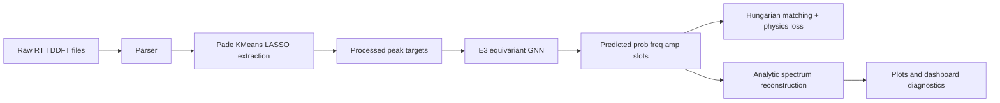

# Electron-GNN Presentation Report (Supervisor Slides)

Date: April 7, 2026  
Version: Stable v1  
Audience: Supervisor / Review Committee

---

## Slide 1: Title and One-Line Pitch

ML-Accelerated Quantum Spectroscopy from Static Molecular Geometry

Pitch:
A physics-guided E(3)-equivariant GNN predicts spectral transition parameters in milliseconds, replacing long RT-TDDFT trajectories for fast screening.

---

## Slide 2: Why This Work Matters

Problem:
RT-TDDFT is accurate but expensive for high-resolution spectra.

Computational burden:
$$
\text{RT-TDDFT cost grows roughly as } O(N_e^3)
$$

Consequence:
Large molecule or high-throughput campaigns become slow and costly.

---

## Slide 3: Core Idea (Analogy)

Analogy:
Do not simulate every water molecule in a wave pool. Instead, identify dominant wave frequencies and amplitudes, then reconstruct the same wave pattern.

Project mapping:
1. Extract dominant spectral peaks from short physics runs.
2. Train GNN to predict those peaks from geometry.
3. Reconstruct full spectrum analytically.

---

## Slide 4: End-to-End Pipeline

---

## Slide 5: Model and Loss Design

Model outputs (fixed K_max slots):
1. prob: peak existence probability
2. freq: transition frequency
3. amp: transition amplitude

Why assignment-based loss is needed:
1. True peaks are an unordered set.
2. Number of true peaks varies by molecule.
3. Hungarian matching aligns predicted slots to true peaks optimally.

Total objective:
1. Bipartite matching loss (frequency + amplitude + probability)
2. Signal-level reconstruction regularizer

---

## Slide 6: Training Snapshot

Key observation:
Training and validation trends are stable in the current run, and best checkpoint selection is based on validation objective.

---

## Slide 7: Ammonia Results (NH3)

| Parity | Spectrum | Dipole Signal |
|:--:|:--:|:--:|
|  |  |  |

Takeaway:
Predicted peaks reconstruct the major spectral and time-domain behavior for ammonia.

---

## Slide 8: Water Results (H2O)

| Parity | Spectrum | Dipole Signal |
|:--:|:--:|:--:|
|  |  |  |

Takeaway:
The model captures the dominant transitions and reconstructs consistent spectral structure for water.

---

## Slide 9: What Is Included in Stable v1

Included:
1. Raw ReSpect parsing pipeline
2. Peak extraction pipeline (Pade + clustering + sparse fit)
3. Graph dataset construction
4. E(3)-aware model training loop
5. Reporting plots and Streamlit diagnostics

---

## Slide 10: Current Limits

1. Small dataset scope (currently ammonia and water only)
2. Fixed output capacity K_max
3. Simplified architecture compared to full production-grade equivariant stacks
4. Limited conformer and temperature effects

---

## Slide 11: Expansion Plan

1. Scale dataset to larger molecular benchmarks
2. Increase model expressivity and equivariant interactions
3. Improve uncertainty quantification
4. Add stronger benchmark splits and experiment tracking
5. Integrate conformer ensemble averaging

---

## Slide 12: Final Summary

Main claim:
A physically informed GNN pipeline can approximate absorption-spectrum-relevant targets from static geometry with large speed advantages over repeated long RT-TDDFT trajectories.

Practical implication:
Useful as a fast pre-screening engine before expensive high-accuracy simulation campaigns.

---

## Optional Speaker Notes (Short)

1. Emphasize this is acceleration, not replacement of all first-principles physics.
2. Highlight where physics priors are injected: extraction targets + reconstruction loss.
3. Clarify stable v1 is a validated baseline and designed for scaling.
