# One-Shot Prediction: Step-by-Step Guide, Diagrams, and Q&A

This document explains **how one-shot prediction works** in Electron-GNN: one full molecular graph in, one forward pass out, then optional decoding to a variable-length peak list. It also collects **diagrams** (Mermaid) and a **questions** section for study and presentations.

**Diagram tooling note:** Diagrams below are **Mermaid** blocks (version-controlled, render in GitHub, VS Code, and Cursor). Section **1A** uses **`classDef`** colors so the encoder, decoder, and heads read as distinct bands in the preview. If a renderer ignores `classDef`, the structure still parses.

**Paper / slide figures (SVG + HTML + CSS):** Open **[electron_gnn_presentation_figures.html](../assets/figures/electron_gnn_presentation_figures.html)** in a browser for vector **SVG** panels (pipeline, V2 stack, graph schematic, hybrid), **print-to-PDF**, and a **dark/light** toggle for projectors.

**Reproducible matplotlib SVGs:** Run `python scripts/make_paper_figures.py` (uses `matplotlib` + optional `networkx`/`torch` already in `requirements.txt`). It writes `fig1_pipeline.svg`, `fig2_v2_stack.svg`, `fig3_graph_schematic.svg`, `fig4_hybrid.svg`, plus **`fig5_real_graphs.svg`** and **`fig6_target_spectra.svg`** built from the actual `data/processed/*.pt` files. SVGs are editable in Inkscape/Illustrator (`svg.fonttype=none`).

For Mermaid-only exports, use [Mermaid Live](https://mermaid.live) or `npx @mermaid-js/mermaid-cli`.

---

## 1. What “one-shot” means here

**Definition:** For a single molecule at one geometry, the model performs **exactly one neural network forward pass** over the **complete** atom graph (all nodes and all cutoff edges). There is **no** sliding window over atoms, bonds, or time.

**Output shape concept:** The network always emits a **fixed capacity** of `K_max` **slots** (each slot: existence probability, frequency, amplitude). A separate **decode** step turns slots into a **variable-length** peak list for plotting and metrics.

---

## 1A. Visual layer stack — `SpectralEquivariantGNN` (V2 tower)

Default constructor values from `models/mace_net.py`: `hidden_dim=128`, `K_max=64`, `num_layers=4`, `num_heads=4`, `node_features_in=5`, `edge_attr` dim `4`, Transformer decoder depth `2`, FFN `4 * hidden_dim`.

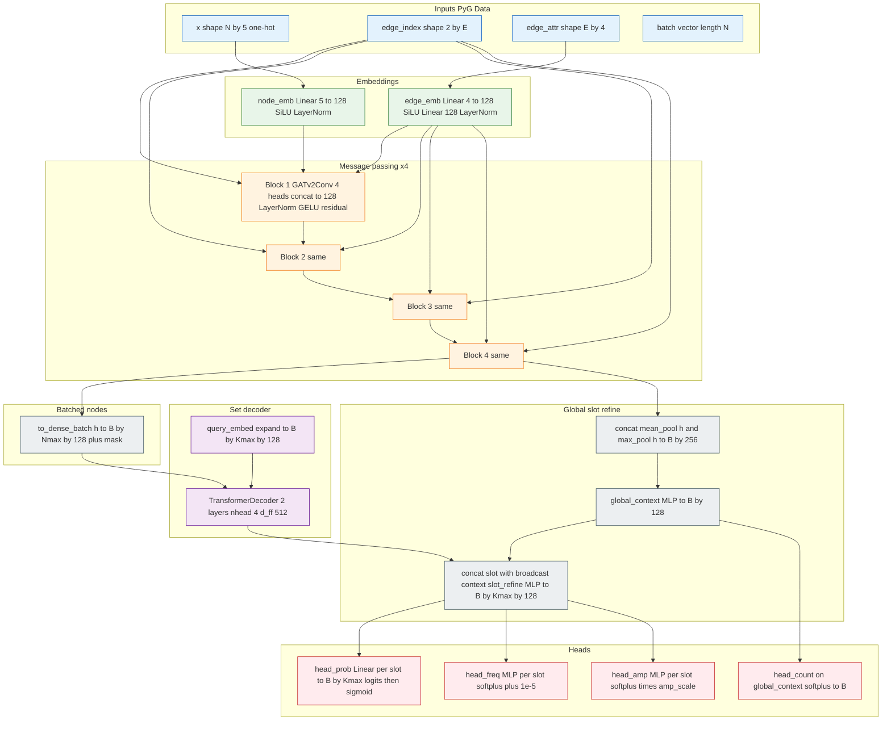

---

## 1B. Tensor shape “bus” (single molecule, batch B equals 1)

Notation: **N** = num atoms, **E** = num directed edges within cutoff, **K** = `K_max`, **H** = `hidden_dim`.

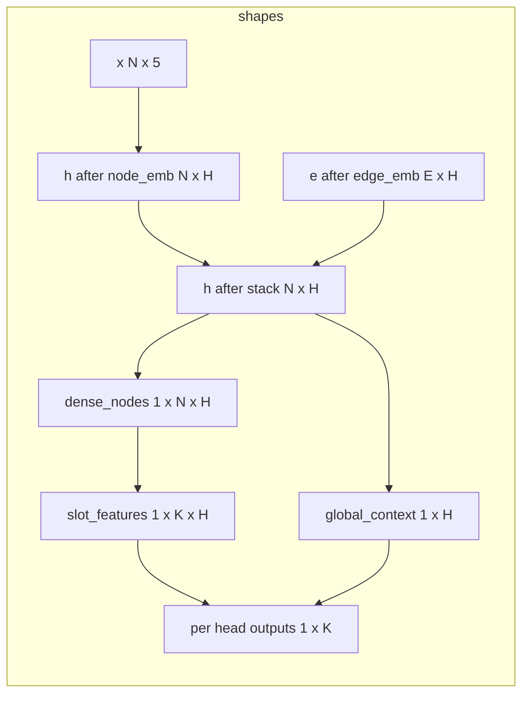

---

## 1C. One message-passing block (what repeats four times)

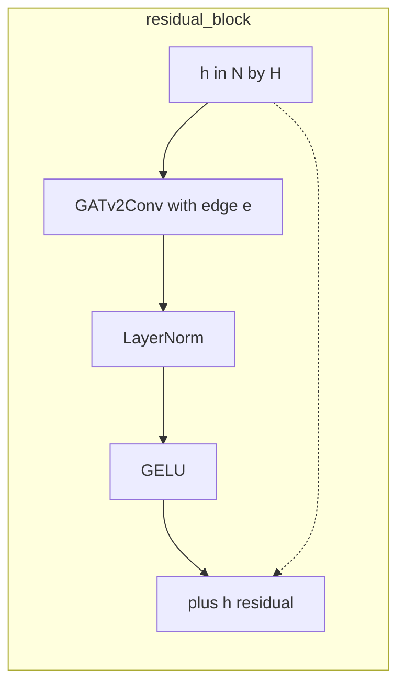

Each node updates from **neighbors within cutoff**; edge vectors modulate **attention** (GATv2).

---

## 1D. Set decoder: slots read the whole molecule

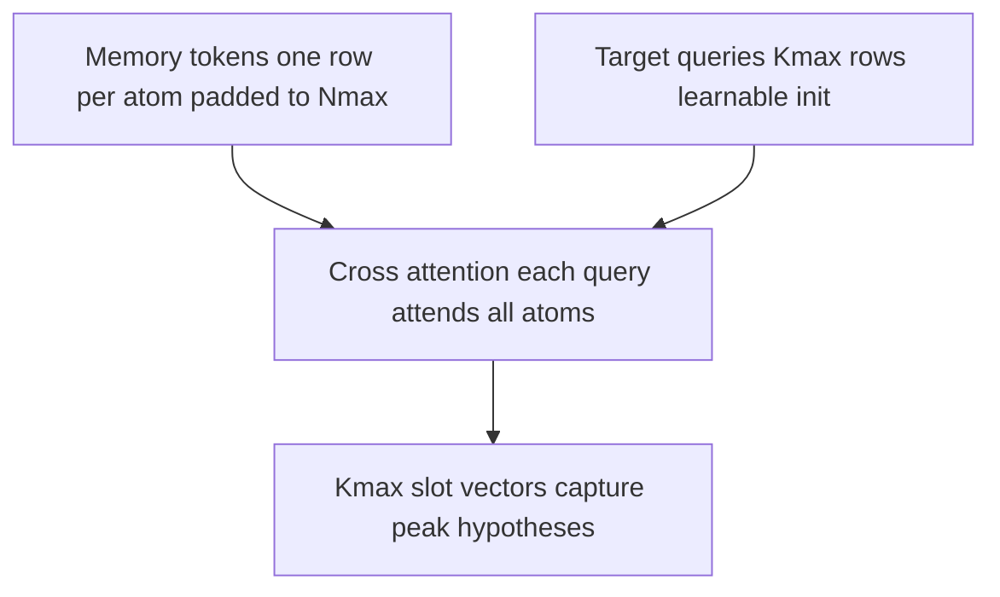

This is why the model can emit **K** different peaks in **one** forward: each query slot is a separate “hypothesis” competing and specialized via training.

---

## 1E. Graph construction as a computational picture

Cutoff default **5.0** a.u. Edges are **directed**: both i to j and j to i can exist if both distances pass.

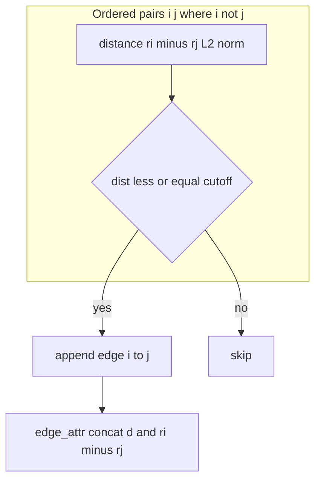

---

## 1F. Post forward decode logic (`decode_peak_set`)

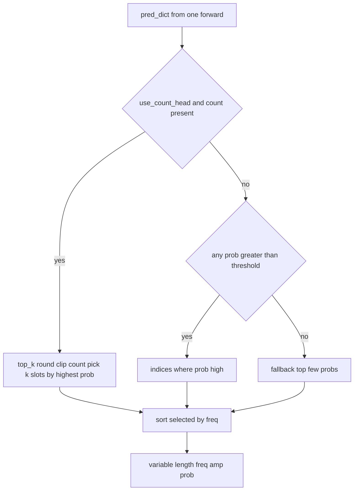

---

## 1G. Annotated forward — same order as `SpectralEquivariantGNN.forward`

```python
# Pseudocode aligned with models/mace_net.py — not a copy paste of imports

def forward_one_shot(data):
    x, edge_index, edge_attr, batch = data.x, data.edge_index, data.edge_attr, data.batch

    h = node_emb(x)           # (N, H)
    e = edge_emb(edge_attr)   # (E, H)

    for conv, norm in zip(convs, norms):
        h_res = h
        h = conv(h, edge_index, e)
        h = norm(h)
        h = gelu(h)
        h = h + h_res         # (N, H) after each block

    dense_nodes, node_mask = to_dense_batch(h, batch)   # (B, Nmax, H), (B, Nmax)

    queries = query_embed.expand(B, K_max, H)           # learned slots
    slot_features = transformer_decoder(
        tgt=queries, memory=dense_nodes,
        memory_key_padding_mask=~node_mask,
    )                                                   # (B, K_max, H)

    pooled = cat([mean_pool(h, batch), max_pool(h, batch)], dim=-1)  # (B, 2H)
    global_context = mlp_global(pooled)                 # (B, H)

    slot_features = slot_refine(
        cat([slot_features, global_context.unsqueeze(1).expand(B, K_max, H)], dim=-1)
    )                                                   # (B, K_max, H)

    count = softplus(head_count(global_context))      # (B,)
    prob_logits = head_prob(slot_features).squeeze(-1)
    prob = sigmoid(prob_logits)                         # (B, K_max)
    freq = softplus(head_freq(slot_features)) + 1e-5 # (B, K_max)
    amp = softplus(head_amp(slot_features)) * amp_scale

    return dict(prob=prob, prob_logits=prob_logits, freq=freq, amp=amp, count=count)
```

---

## 1H. V1 frequency tower — smaller stack (for hybrid context)

`SpectralEquivariantGNNV1` in `models/mace_net_v1.py` uses **global add pool** over nodes then MLP heads to **`K_max` slots** (default 50 in many checkpoints). No Transformer decoder. Hybrid inference still uses **one full-graph forward** per tower.

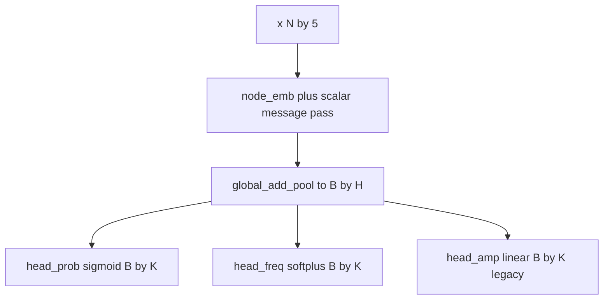

---

## 2. End-to-end pipeline (data to decoded peaks)

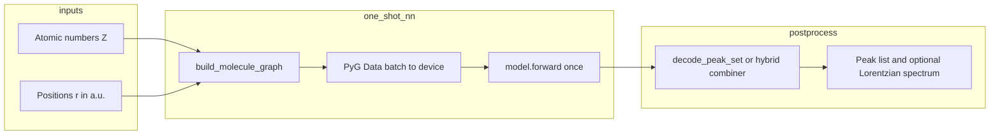

---

## 3. Detailed steps: V2 amplitude tower (single forward)

Implementation anchors: `models/molecule_graph.py`, `models/mace_net.py`, `utils/hybrid_inference.py`.

### Step 0 — Inputs available at inference time

| Input | Meaning | Typical source |
|------|---------|----------------|
| `atomic_numbers` | Integer Z per atom | Processed `.pt` or parsed `.xyz` |
| `positions` | Cartesian coordinates in **atomic units** | Same |

Targets `y_freq`, `y_amp` are **not** required for prediction; they are used only for training and evaluation.

### Step 1 — Construct the molecular graph (`build_molecule_graph`)

For each atom `i`:

1. **Node feature** `x[i]`: one-hot over `[H, C, N, O, F]` (unknown Z maps to last column).
2. For every **ordered** pair `(i, j)` with `i != j`:
   - If distance `||r_i - r_j|| <= cutoff_radius` (default **5.0** a.u.), add a **directed** edge `i -> j`.
3. **Edge attribute** for that edge: `[distance, r_i - r_j]` → length-4 vector.

PyTorch Geometric `Data` fields: `x`, `edge_index`, `edge_attr`, `pos`, `z`.

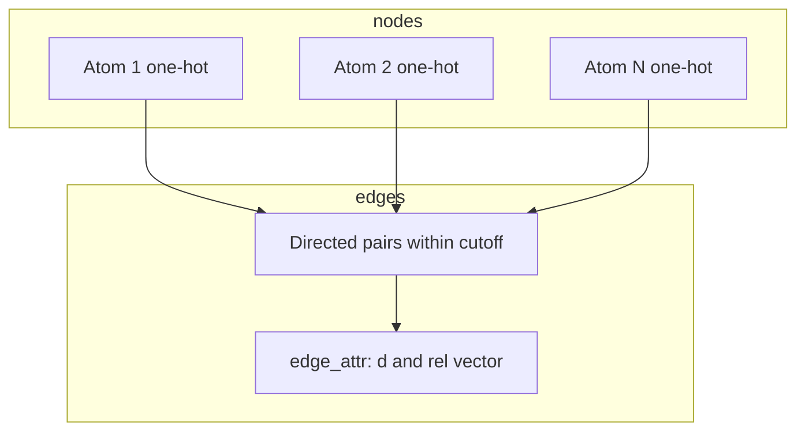

### Step 2 — Batch and device

- For a single molecule, `batch` is a vector of zeros (one graph in the batch).
- `data.to(device)` moves tensors to CPU or CUDA.

### Step 3 — Encoder: node and edge embeddings

1. `h = node_emb(x)` — map each node’s 5-d one-hot to `hidden_dim`.
2. `e = edge_emb(edge_attr)` — map each edge’s 4-d geometry to `hidden_dim`.

### Step 4 — Message passing stack (GATv2)

Repeat for `num_layers` (default 4):

1. `h = GATv2Conv(h, edge_index, e)` — each node aggregates **attention-weighted** messages from neighbors, using edge features.
2. LayerNorm, GELU, **residual** add.

After this stack, each node carries a context vector that depends on its **multi-hop** neighborhood (receptive field grows with depth).

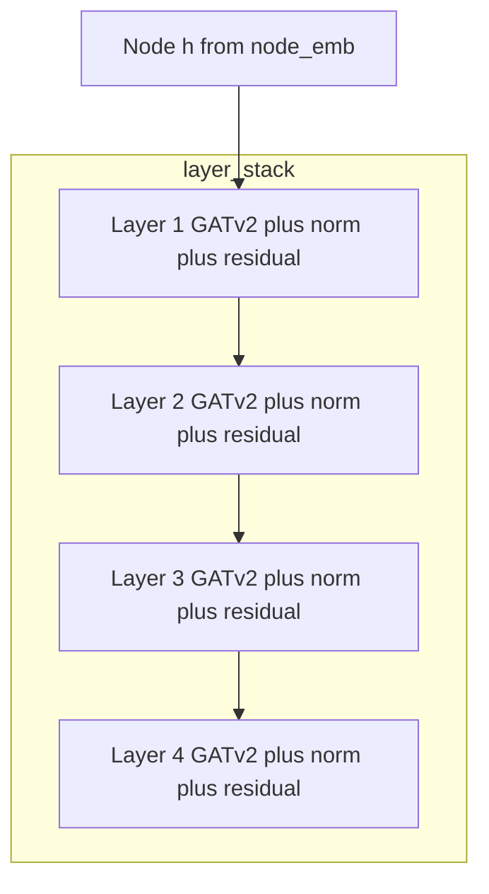

### Step 5 — From sparse nodes to dense batch (`to_dense_batch`)

Node tensors are **padded** to a dense `[batch_size, max_nodes, hidden_dim]` matrix with a **mask** so the decoder knows which positions are real atoms vs padding.

### Step 6 — Set decoder (Transformer over learned queries)

1. **Learned query embeddings** `query_embed` shape `[K_max, hidden_dim]` are expanded per batch item.
2. `TransformerDecoder(tgt=queries, memory=dense_nodes, mask=...)` runs **2** decoder layers: each of the `K_max` queries **attends to all node tokens** (DETR-style set prediction).
3. Output: `slot_features` with shape `[batch_size, K_max, hidden_dim]`.

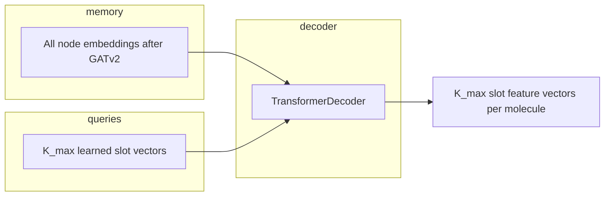

### Step 7 — Global context injection

1. Pool node states: **concat** of `global_mean_pool(h)` and `global_max_pool(h)`.
2. MLP → `global_context` per graph, broadcast to each slot.
3. **Concat** slot features with this context → `slot_refine` MLP → refined slot features.

This ties each slot to both **local cross-attention** (decoder) and a **whole-graph summary**.

### Step 8 — Prediction heads (per slot, per graph)

From refined slot features and `global_context`:

| Head | Output | Post-processing in forward |
|------|--------|----------------------------|
| `head_count` | scalar **count** per graph | `softplus` (non-negative, continuous) |
| `head_prob` | logit per slot | `sigmoid` → `prob` in `[0,1]` |
| `head_freq` | raw per slot | `softplus` + small epsilon → positive frequency |
| `head_amp` | raw per slot | `softplus` × `amp_scale` → non-negative amplitude |

Return dict keys include: `prob`, `prob_logits`, `freq`, `amp`, `count`.

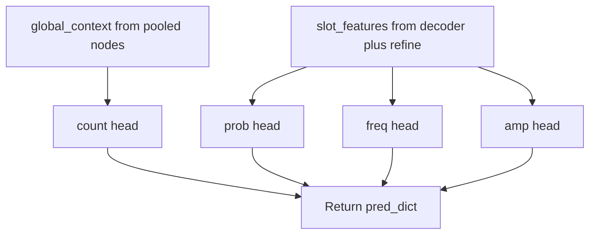

**This completes the single neural forward pass** (one-shot).

### Step 9 — Decode to a variable-length peak set (not part of `forward`)

`decode_peak_set` in `utils/hybrid_inference.py`:

1. If **count head** is used and present: take `top_k = round(count)` clipped to `[1, K_max]`, choose slots with **largest** `prob` among all slots (by sorting).
2. Else: keep slots with `prob > threshold`; if none, **fallback** to top few by `prob`.
3. Gather `freq`, `amp`, `prob` at selected indices; sort by frequency for readability.

No second forward pass; this is **numpy/torch indexing** on the first pass outputs.

---

## 4. V3 hybrid one-shot (two forwards, still not sliding window)

**Definition:** Still **one graph**; you run **two** independent full-graph forwards (V1 frequency tower + V2 amplitude tower), then **`combine_two_tower_predictions`** merges frequencies from V1 with amplitudes matched from V2 (Hungarian-style linear assignment on frequency distance plus optional overflow logic).

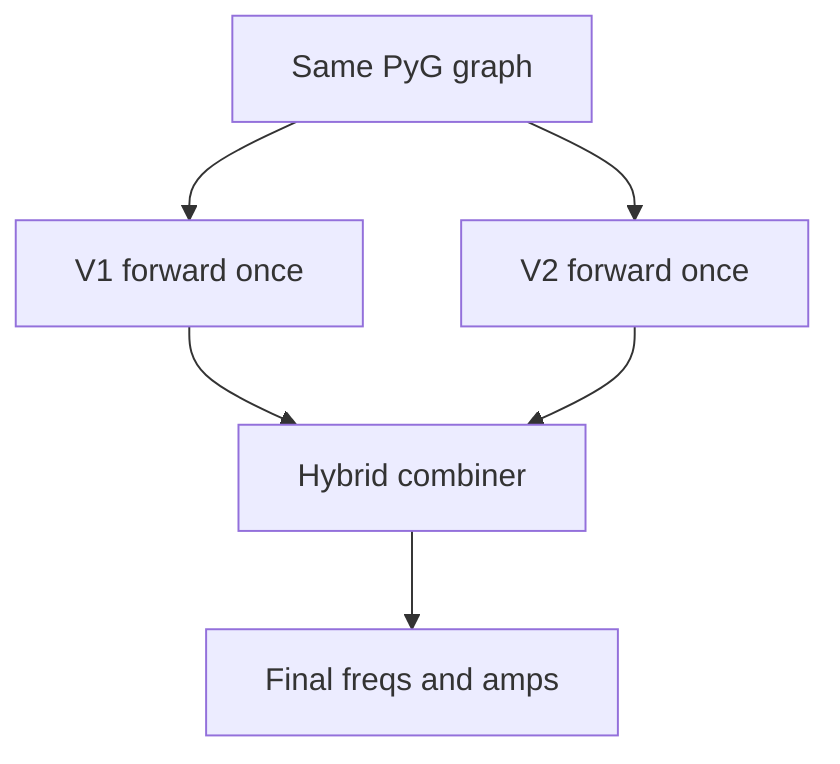

---

## 5. Training vs prediction (same graph, different objective)

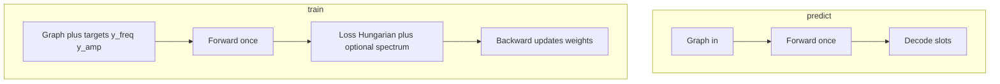

Training uses **labels** and **loss**; prediction stops after forward (plus decode).

### 5A. Where the gradients flow (same layer diagram, different arrows)

Gradients flow **backward** through the same modules as the forward pass. The **graph tensors** (`x`, `edge_index`, `edge_attr`) are inputs; **weights** in `node_emb`, `edge_emb`, each `GATv2Conv`, decoder, and heads receive updates.

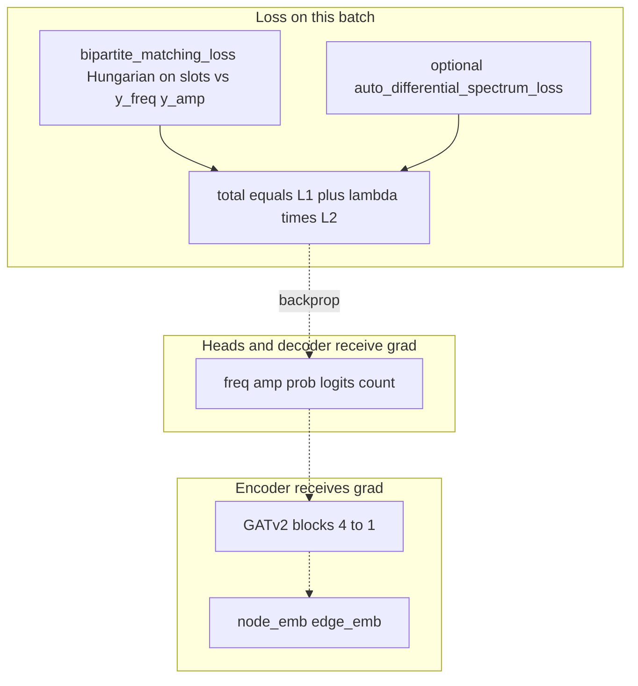

The **Hungarian assignment** is computed on detached costs in current code, but matched-slot **MSE/BCE** still backprops through the **selected** slot outputs.

---

### 5B. From decoded peaks to a spectrum (visual, not extra neural layers)

After you have arrays `freq_k` and `amp_k`, many scripts build a **Lorentzian** sum on a frequency grid (see `scripts/evaluate_two_tower.py` and `train/losses.py`). This is **analytic geometry**, not another GNN layer.

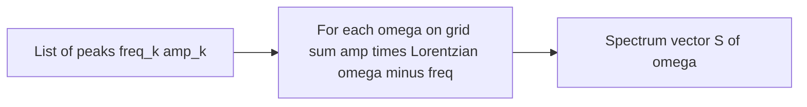

---

## 6. Questions and answers (living section)

### Q1: Is the graph itself “trained”?

**A:** The **parameters** of the neural network are trained. The graph structure for a given molecule snapshot is **fixed input** (positions and Z from your data). You are not optimizing atom positions in the default training loop.

### Q2: Why fixed `K_max` slots if the true number of peaks changes?

**A:** The model is a **set predictor** with fixed maximum capacity. **Hungarian matching** in training aligns slots to true peaks; at inference, **threshold / count / top-k** selects an active subset.

### Q3: Is this the same as a CNN sliding window over a spectrum image?

**A:** No. There is **no** spatial window over a 2D spectrum image in the GNN path. The spectrum image (if shown) is built **after** peak prediction (e.g. Lorentzian sum).

### Q4: Where does the time-domain dipole enter the GNN?

**A:** In the **default offline pipeline**: dipole traces are used in **`scripts/extract_peaks.py`** to build **supervised targets**. The GNN at inference maps **geometry to peaks**, not raw dipole trajectories (unless you add a separate branch in a future design).

### Q5: Add your own questions below

- **Q:**  
  **A:**  

---

## 7. File map (quick reference)

| Stage | File |
|------|------|
| Graph build | `models/molecule_graph.py` |
| Dataset attach targets | `train/dataset.py` |
| V2 model forward | `models/mace_net.py` |
| V1 frequency tower | `models/mace_net_v1.py` |
| Training loop V2 | `train/train.py` |
| Training two towers | `train/train_v3_two_tower.py` |
| Losses | `train/losses.py` |
| Slot decode and hybrid | `utils/hybrid_inference.py` |
| Eval compare V1 V2 Hybrid | `scripts/evaluate_two_tower.py` |

---

*Last updated: aligned with repository layout and `SpectralEquivariantGNN.forward` as of the doc creation date.*
