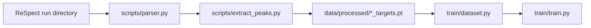

# Professor Request Sheet + Data Generation Playbook

## Purpose
This document has two goals:
1. List exactly what we need from the professor to materially improve model quality.
2. Provide a practical, self-run data-generation workflow using only the current repository, scripts, and libraries.

---

## 1) Current Status Snapshot
- Processed samples: 2 (`ammonia_targets.pt`, `water_targets.pt`).
- True peak counts: 39 (NH3), 55 (H2O).
- Current best model (V2 architecture) behavior:
  - Peak count prediction is close to true counts.
  - Frequency parity is good.
  - Amplitude calibration improved but still underpowered in some regions.
- Core bottleneck: dataset diversity/size, not code execution.

---

## 2) What We Need From Professor (Priority Ordered)

| Priority | Ask | Why It Matters | Expected Impact |
|---|---|---|---|
| P0 | Approve a target molecule list (at least 50-100 molecules) | Two molecules cannot define a robust mapping from geometry to spectral amplitudes | Biggest gain in generalization and calibration |
| P0 | Approve a fixed RT-TDDFT protocol (basis, functional, kick amplitude, dt, total steps) | Mixed simulation settings create label shift and unstable training | Makes labels consistent and learnable |
| P0 | HPC allocation for bulk data generation (compute + queue priority) | Data generation is the runtime bottleneck | Enables scaling from 2 samples to 100+ |
| P0 | Storage allocation for raw trajectories and extracted labels | Raw folders include many density frames and large outputs | Prevents interruptions and data loss |
| P1 | Approve x/y/z polarization runs (not x-only) | Amplitude/vector physics is axis dependent | Improves physically correct amplitude learning |
| P1 | Approve conformer strategy (e.g., 3-10 conformers/molecule) | Geometry variation is necessary for robust structural learning | Reduces overfitting to single geometry |
| P1 | Provide benchmark acceptance criteria (target spectral overlap / MAE thresholds) | Avoids ambiguous model quality claims | Gives objective stop conditions |
| P2 | Optional external validation set (experimental or high-accuracy reference spectra) | Internal metrics can look good but still be biased | Stronger scientific credibility |

---

## 3) Copy-Paste Request To Send Professor

Subject: Resources Needed To Scale Electron-GNN Spectral Model

Dear Professor,

To move the current Electron-GNN model from proof-of-concept (2 molecules) to a scientifically reliable model, I need approval and support for the following:

1. Molecule campaign: a curated list of at least 50-100 molecules.
2. Fixed RT-TDDFT protocol: one standardized setup (functional, basis, dt, kick amplitude, run length).
3. HPC resources: sufficient compute hours and queue access for bulk RT-TDDFT generation.
4. Storage: dedicated space for raw outputs and processed targets.
5. Polarization coverage: x/y/z runs to improve physically correct amplitude learning.
6. Conformer policy: 3-10 conformers per molecule.
7. Evaluation targets: agreed acceptance metrics for spectral overlap and parity errors.

This support is required mainly for data scaling; the software pipeline for extraction, training, and diagnostics is already in place.

Regards,

---

## 4) Should We Replace V1 Extrapolation Now?
Short answer: no.

- Keep the current V1 extraction method (Pade + clustering + LASSO via existing HyQD path) as the production label engine for now.
- First, scale data and enforce quality gates.
- Replace/refine extraction only if we observe systematic label instability at scale.

Why:
- Present error profile is dominated by low sample count.
- Changing extractor before data scaling adds confounding variables.

---

## 5) How To Generate Required Data Ourselves (Using Existing Repo/Tools)

### 5.1 Existing Tools Already Available
- ReSpect raw parser: `scripts/parser.py`
- Peak extraction pipeline: `scripts/extract_peaks.py`
- HyQD absorption-spectrum library path: `lib/absorption-spectrum`
- Processed dataset loader: `train/dataset.py`
- Training pipeline: `train/train.py`

### 5.2 Required Raw Folder Pattern
Each sample folder in `data/raw` must look like:

- `data/raw/<sample_name>_x/`
  - one `*.out` file (dipole time signal source)
  - one `*.xyz` file (atom geometry source)
  - optional `rvlab.tdscf.rho.*` files (not required for training labels)

For multi-axis campaigns, use separate folders:

- `data/raw/<sample_name>_x/`
- `data/raw/<sample_name>_y/`
- `data/raw/<sample_name>_z/`

Current folders follow this format (`ammonia_x`, `water_x`).

### 5.3 Label Generation Flow


### 5.4 Practical Commands
From repository root:

```bash
# 1) Add new raw folders under data/raw, each ending with _x (or update script for y/z)
# 2) Extract peak labels from all *_x folders
/home/user/Electron-GNN/EGNN/bin/python scripts/extract_peaks.py

# 3) Verify outputs
ls data/processed/*.pt

# 4) Train
/home/user/Electron-GNN/EGNN/bin/python -m train.train --epochs 120 --batch_size 1 --lr 5e-4 --lambda_spectrum 0.2
```

### 5.5 Recommended RT-TDDFT Settings (Web-Grounded Baseline)
Use one fixed protocol for all molecules in a campaign. The exact code (ReSpect, Octopus, GPAW, etc.) can differ, but the numerical intent should be consistent:

- Ground state must be tightly converged (especially density, not only total energy).
- Use a small delta-kick to stay in the linear-response regime.
- Choose a stable time step and keep it fixed across the campaign.
- Keep total propagation time fixed within each campaign stage.
- Run x/y/z kicks for anisotropic molecules if possible.

Why this matters:
- Octopus RT-TDDFT tutorial emphasizes kick size, timestep stability, and propagation length effects on spectral width.
- GPAW RT-TDDFT notes emphasize stricter density convergence and careful electrostatics setup for stable propagation.

Practical interpretation for this repo:
- Do not mix simulation settings between molecules inside the same training dataset.
- If settings change, tag outputs as a separate dataset version (for example `v2_protocolB`).

### 5.6 Scaling Formula
If we use:
- `M` molecules,
- `C` conformers per molecule,
- `P` polarizations (`x`, `y`, `z` => `P=3`),

then total samples are:

\[
N = M \times C \times P
\]

Example: `M=80`, `C=5`, `P=3` gives `N=1200` samples.

### 5.7 Recommended Campaign Stages
1. Stage A: 20 molecules, 1 conformer, x-only (pipeline validation).
2. Stage B: 50 molecules, 3 conformers, x-only (frequency robustness).
3. Stage C: 80-120 molecules, 3-10 conformers, x/y/z (amplitude calibration).

### 5.8 Suggested Naming And Manifest Scheme
To keep large campaigns reproducible, store each generated sample with a deterministic name:

- `<molecule>__conf<id>__axis<x|y|z>__method<functional_basis>__dt<...>__steps<...>`

Maintain a campaign manifest CSV/TSV containing at least:

- sample_id
- molecule identifier
- conformer id
- axis
- simulation method/basis
- dt
- n_steps
- kick strength
- file paths to `.out`, `.xyz`
- extraction status
- notes/errors

This can be generated with existing Python tools in this repo and avoids silent data drift.

### 5.9 Minimal Automation Loop (Reusable)
For each planned sample:

1. Run RT-TDDFT job under fixed protocol.
2. Place outputs in `data/raw/<sample>_<axis>/`.
3. Run extraction script (`scripts/extract_peaks.py`).
4. Validate target file with quality gates (Section 6).
5. Append row to manifest and mark status pass/fail.
6. Train/evaluate only on passed samples.

---

## 6) Data Quality Gates Before Training

Run these checks per new processed file:
- Peak count in plausible range (non-zero, not extreme outlier).
- Frequency range physically plausible (no obvious extraction artifacts).
- Amplitude distribution not degenerate (all near-zero or exploding).
- Extraction success logs do not report repeated failure states.
- Optional consistency check: reconstructed dipole from extracted peaks should overlap the original dipole trajectory above a threshold.
- Optional sum-rule style sanity checks if your upstream simulator provides them.

Reject/flag samples that fail gate checks before model training.

Suggested initial reject thresholds (tune after first 100 samples):
- reject if peak count is 0
- flag if peak count is beyond 3x campaign median
- reject if all amplitudes are below 1e-10
- reject if duplicate frequencies dominate (>30 percent near-identical within tolerance)

---

## 7) Expected Benefit Of More Data
- Better amplitude calibration (current hardest part).
- Better generalization to unseen molecules/geometries.
- More stable count prediction and cleaner slot selection.
- Higher spectral overlap and reduced parity scatter.

In short: new data is the highest-leverage improvement now.

---

## 8) External References Used To Improve This Plan

These are practical sources that support the protocol recommendations above:

1. Octopus tutorial on optical spectra from time propagation (kick size, timestep, propagation length, x/y/z runs).
2. GPAW RT-TDDFT docs (tight density convergence, restartable real-time propagation, dipole output workflow).
3. PySCF TDDFT user docs (transition properties and oscillator strengths; useful as a cross-check baseline for small systems).
4. Hauge et al. extraction strategy used by the repo's HyQD pipeline (Padé + clustering + sparse regression target extraction), as cited in `README.md`.

Recommendation:
- Keep the extraction method fixed while scaling data.
- Revisit extractor changes only after enough data exists to separate label noise from model limitations.
