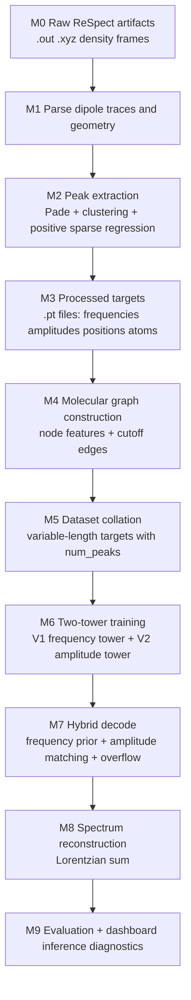

# Master Report: Electron-GNN Full End-to-End Pipeline (Raw Data to Inference)

## 1. What We Are Tackling

We are tackling fast and physically consistent prediction of molecular absorption-like spectra from molecular structure.

Core challenge:
- Traditional RT-TDDFT gives high-fidelity spectra but is computationally expensive.
- We need a model that predicts transition sets quickly while preserving physically meaningful peak structure.

Target output per molecule:
- unordered transition frequencies: $\{\omega_k\}$
- unordered transition amplitudes: $\{B_k\}$
- reconstructed spectrum via Lorentzian superposition.

## 2. Why We Are Tackling It

### 2.1 Scientific reason
We want to map molecular geometry to excited-state spectral behavior without running full real-time propagation each time.

### 2.2 Engineering reason
The ML inference path is dramatically faster than repeated full simulations and enables rapid screening.

### 2.3 Modeling reason
Predicting a sparse set of transitions is a better inductive bias than regressing a dense spectrum directly:
$$
\text{Structure} \to \{(\omega_k, B_k, p_k)\}_{k=1}^{K_{max}} \to S(\omega)
$$

## 3. Master Pipeline Map (Labeled)



Implementation anchors:
- `scripts/parser.py`
- `scripts/extract_peaks.py`
- `models/molecule_graph.py`
- `train/dataset.py`
- `models/mace_net_v1.py`
- `models/mace_net.py`
- `train/losses.py`
- `train/train_v3_two_tower.py`
- `utils/hybrid_inference.py`
- `scripts/evaluate_two_tower.py`

## 4. Symbol Table

| Symbol | Meaning |
|---|---|
| $N$ | number of atoms |
| $K_{max}$ | fixed decoder slot count |
| $K_{true}$ | true number of transitions |
| $\mathbf{r}_i$ | atom position of atom $i$ |
| $\mathbf{x}_i$ | node feature of atom $i$ |
| $\mathcal{E}$ | directed edge set |
| $p_k$ | existence probability for slot $k$ |
| $\omega_k$ | transition frequency |
| $B_k$ | transition amplitude |
| $\hat{K}$ | predicted count from count head |
| $S(\omega)$ | reconstructed spectrum |
| $\gamma$ | Lorentzian broadening |

## 5. Stage-by-Stage Equations

## 5.1 Stage M0-M1: Raw Data and Parsing

From ReSpect outputs, we parse time-indexed dipole traces:
$$
\mathcal{D}_a = \{(t_n, \mu_a(t_n))\}_{n=0}^{T-1}, \quad a \in \{x,y,z\}.
$$

Geometry parser returns atomic numbers and Cartesian coordinates:
$$
\mathcal{G} = \{(Z_i, \mathbf{r}_i)\}_{i=1}^{N}, \quad \mathbf{r}_i \in \mathbb{R}^3.
$$

## 5.2 Stage M2: Peak Extraction (Physics-Guided)

The extracted dipole response is represented by sparse oscillatory components:
$$
\mu_x(t) \approx \sum_{k=1}^{K_{cand}} B_k \sin(\omega_k t), \quad B_k \ge 0.
$$

Conceptual sparse positive regression form:
$$
\min_{\{B_k\}} \left\|\mu_x(t) - \sum_k B_k\sin(\omega_k t)\right\|_2^2 + \lambda \|B\|_1
\quad \text{s.t. } B_k \ge 0.
$$

Active peaks are kept with threshold used in code:
$$
B_k > 10^{-8}.
$$

## 5.3 Stage M3-M4: Graph Construction (How the Grid Is Made)

In this project, the "grid" for the GNN is a molecular interaction graph.

### Node features
One-hot element encoding over [H, C, N, O, F]:
$$
\mathbf{x}_i = \text{onehot}(Z_i) \in \{0,1\}^5.
$$

### Edge decision rule (exact implementation)
Directed edge $i \to j$ is created iff:
$$
i \ne j \quad \text{and} \quad \|\mathbf{r}_i - \mathbf{r}_j\|_2 \le r_c,
$$
with default cutoff:
$$
r_c = 5.0 \;\text{(atomic units)}.
$$

So,
$$
\mathcal{E} = \{(i,j): i \ne j,\; d_{ij} \le r_c\}, \quad d_{ij}=\|\mathbf{r}_i-\mathbf{r}_j\|_2.
$$

### Edge features
$$
\mathbf{e}_{ij} = [d_{ij},\; \Delta x_{ij},\; \Delta y_{ij},\; \Delta z_{ij}],
$$
$$
(\Delta x_{ij},\Delta y_{ij},\Delta z_{ij}) = \mathbf{r}_i - \mathbf{r}_j.
$$

### Why edges are decided this way
- Locality prior: electronic interactions decay with distance, so radius-based neighborhoods encode physically relevant interactions.
- Stability: cutoff avoids very long-range noisy couplings for small data.
- Efficiency: sparse neighborhoods reduce compute compared with always fully connected graphs.
- Directionality: using ordered pairs $(i,j)$ with relative vectors preserves directional geometric information for message passing.

## 5.4 Stage M5: Dataset Collation for Variable-Length Targets

Each graph stores:
- $y_{freq} \in \mathbb{R}^{K_{true}}$
- $y_{amp} \in \mathbb{R}^{K_{true}}$
- $num\_peaks = K_{true}$

During batching, targets are flattened and then split back per graph via cumulative offsets:
$$
\text{offset}_{b+1} = \text{offset}_b + K_{true}^{(b)}.
$$

## 5.5 Stage M6A: Frequency Tower (V1)

Frequency tower outputs fixed slots:
$$
\mathbf{p}^{(f)} \in [0,1]^{K_{max}}, \quad
\boldsymbol{\omega}^{(f)} \in \mathbb{R}_{>0}^{K_{max}}.
$$

Hungarian matching cost for frequency supervision:
$$
C^{(f)}_{ij} = |\omega^{(f)}_i - \omega^{(t)}_j|.
$$

Frequency training loss (exact weights in code):
$$
\mathcal{L}_{freq} = 12\mathcal{L}_{\omega} + 1\mathcal{L}_{prob} + 0.3\mathcal{L}_{count} + 0.02\mathcal{L}_{unmatched}.
$$

## 5.6 Stage M6B: Amplitude Tower (V2 Core)

Model outputs per slot:
$$
p_k = \sigma(f_{prob}(\mathbf{s}_k)),
$$
$$
\omega_k = \text{Softplus}(f_{freq}(\mathbf{s}_k)) + 10^{-5},
$$
$$
B_k = \text{Softplus}(f_{amp}(\mathbf{s}_k))\cdot s_{amp},
$$
$$
\hat{K} = \text{Softplus}(f_{count}(\mathbf{c}_{global})).
$$

Message-passing update (conceptual form):
$$
\mathbf{h}_i^{(\ell+1)} = \text{GELU}(\text{LN}(\text{GATv2}^{(\ell)}(\mathbf{h}^{(\ell)}, \mathbf{e}))) + \mathbf{h}_i^{(\ell)}.
$$

## 5.7 Stage M6C: Amplitude Losses and Regularization

Hungarian matching cost in amplitude tower training:
$$
C_{ij} = 10|\omega_i - \omega_j^{(t)}| + |B_i - B_j^{(t)}|.
$$

Bipartite objective (exact coefficients):
$$
\mathcal{L}_{bip} = 8\mathcal{L}_{\omega} + 8\mathcal{L}_{amp} + 1.2\mathcal{L}_{prob} + 1.0\mathcal{L}_{unmatched\_amp} + 6.0\mathcal{L}_{sum} + 0.5\mathcal{L}_{count}.
$$

Log-amplitude supervision:
$$
\mathcal{L}_{amp} = \text{SmoothL1}(\log(1+10^4 B_{pred}),\log(1+10^4 B_{true})).
$$

Auto-differential spectrum regularizer:
$$
\mathcal{L}_{spec\_auto} = \mathcal{L}_{time} + 0.5\mathcal{L}_{spec} + 0.5\mathcal{L}_{area}.
$$

Total amplitude tower objective:
$$
\mathcal{L}_{amp\_tower} = \mathcal{L}_{bip} + \lambda_{spec}\mathcal{L}_{spec\_auto}, \quad \lambda_{spec}=0.3.
$$

Training-time grids used in code:
- time grid: $t \in [0,400]$, step $dt=0.2$
- spectral grid: 512 points in $\omega \in [0.01, \max(5.0, 1.1\max(\omega_{true}))]$

## 5.8 Stage M6D: Validation Quality Gate

Amplitude checkpoint promotion uses decode quality score:
$$
Q = \text{overlap} - 0.25\cdot\text{count\_error},
$$
$$
\text{count\_error} = \frac{|K_{pred} - K_{true}|}{\max(1,K_{true})}.
$$

The best checkpoint is selected by quality-first logic with early stopping.

## 5.9 Stage M7: Hybrid Decode (Production V3)

Primary frequencies come from frequency tower slots.
Amplitudes come from amplitude tower after assignment.

Hybrid assignment cost:
$$
C^{(hyb)}_{ij} = |\omega^{(f)}_i - \omega^{(a)}_j| + \lambda_c(1-p^{(a)}_j), \quad \lambda_c=0.05.
$$

Overflow extension rule (enabled by default):
If desired count exceeds selected frequency slots, borrow amplitude-tower candidate frequencies subject to minimum separation:
$$
\min_{m \in \mathcal{S}} |\omega_{cand} - \omega_m| \ge \delta_{min},
$$
with tuned default:
$$
\delta_{min}=0.005.
$$

Conservative confidence fusion:
$$
p^{(hyb)}_k = \min\left(p^{(f)}_k,\; p^{(a)}_{\pi(k)}\right).
$$

## 5.10 Stage M8-M9: Spectrum Reconstruction and Metrics

Lorentzian reconstruction:
$$
S(\omega) = \sum_k B_k \frac{\gamma}{(\omega - \omega_k)^2 + \gamma^2}, \quad \gamma=0.015.
$$

Matched MAE (Hungarian):
$$
\text{Freq-MAE} = \frac{1}{|\mathcal{M}|}\sum_{(i,j)\in\mathcal{M}}|\omega_i-\omega_j^{(t)}|,
$$
$$
\text{Amp-MAE} = \frac{1}{|\mathcal{M}|}\sum_{(i,j)\in\mathcal{M}}|B_i-B_j^{(t)}|.
$$

Spectral overlap:
$$
\text{Overlap} = \frac{\langle S_{pred}, S_{true}\rangle}{\|S_{pred}\|_2\,\|S_{true}\|_2 + \epsilon}.
$$

Evaluation grid used in script:
$$
\omega \in [0.01, 5.0], \quad 1024\;\text{points}.
$$

## 6. Current Training and Inference Defaults

Recommended V3 defaults:
- probability threshold: 0.65
- fallback top-k: 8
- allow overflow: true
- minimum frequency separation: 0.005
- amplitude tower epochs: 80

Reference command chain:

```bash
/home/user/Electron-GNN/EGNN/bin/python scripts/extract_peaks.py

/home/user/Electron-GNN/EGNN/bin/python -m train.train_v3_two_tower \
  --data_dir data/processed \
  --epochs_freq 0 \
  --epochs_amp 80 \
  --batch_size 1 \
  --val_ratio 0.5 \
  --amp_early_stop_patience 12 \
  --save_dir checkpoints \
  --log_file results/v3_train_output.log \
  --init_freq_ckpt checkpoints/best_model_v1.pth \
  --init_amp_ckpt checkpoints/best_model.pth

/home/user/Electron-GNN/EGNN/bin/python scripts/evaluate_two_tower.py \
  --data_dir data/processed \
  --v1_ckpt checkpoints/best_model_v1.pth \
  --v2_ckpt checkpoints/best_model.pth \
  --prob_threshold 0.65 \
  --fallback_topk 8 \
  --hybrid_min_freq_separation 0.005

streamlit run dashboard/app.py
```

## 7. What We Are Tackling Now (And Why)

### 7.1 Dataset scale bottleneck
What:
- increase molecule diversity and sample count.

Why:
- current data size is too small for robust amplitude generalization and reliable model ranking.

### 7.2 Amplitude calibration stability
What:
- keep quality-gated checkpointing and evaluate overlap plus count consistency.

Why:
- amplitude MAE alone can look good while reconstructed spectral quality is poor.

### 7.3 Edge-construction robustness
What:
- keep radius-cutoff graph construction as default and evaluate sensitivity to cutoff radius if scaling dataset.

Why:
- cutoff controls neighborhood physics and model bias-variance tradeoff; too small misses interactions, too large adds noise and compute.

## 8. Final Master Summary

This repository now has a complete, labeled, equation-driven pipeline from raw RT-TDDFT artifacts to hybrid GNN inference.

The model stack is structurally sound:
- physics-guided peak extraction,
- graph construction with explicit geometric edge rules,
- two-tower training with set losses,
- hybrid decode with overflow control,
- Lorentzian reconstruction and overlap-centric evaluation.

The primary remaining limiter is data scale, not pipeline completeness.
