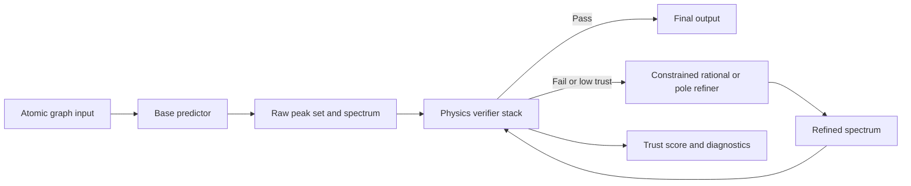
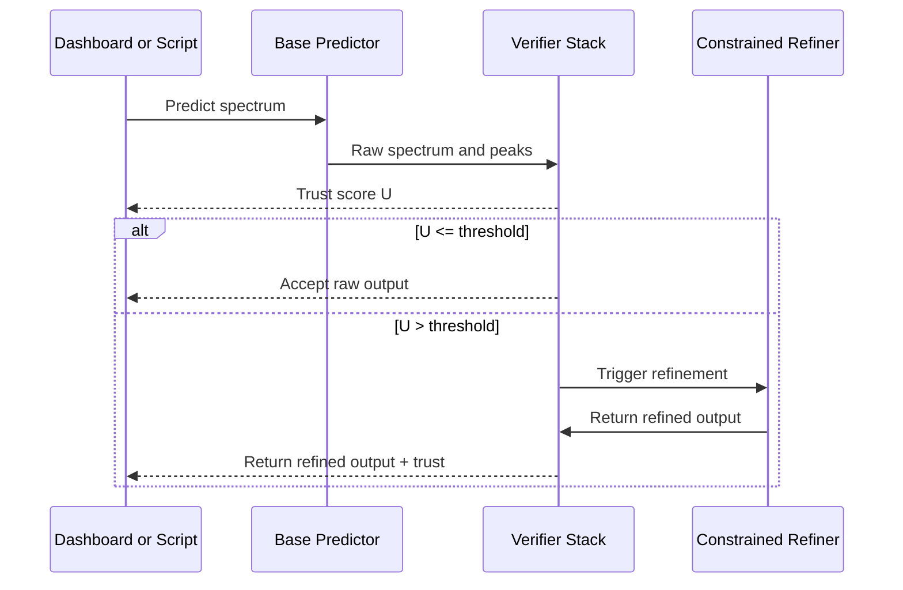
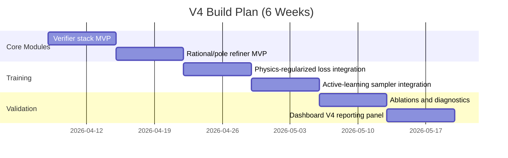
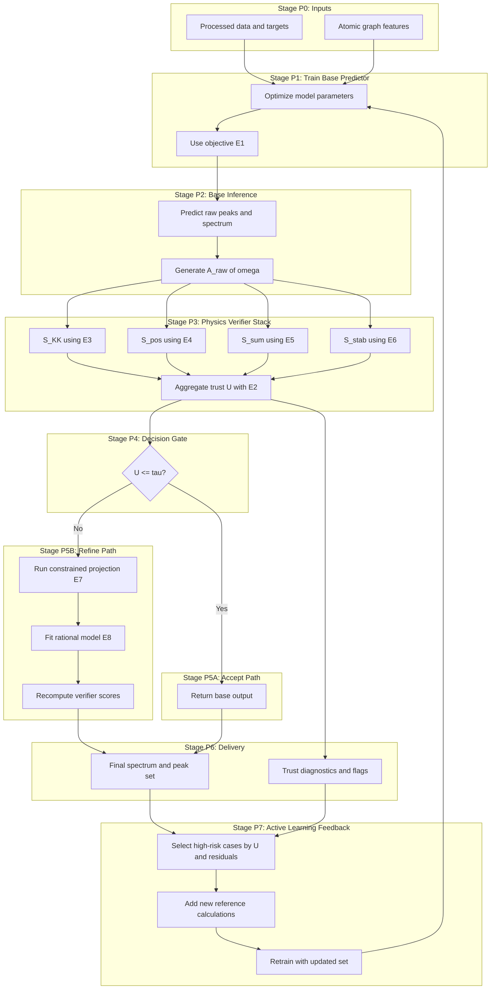
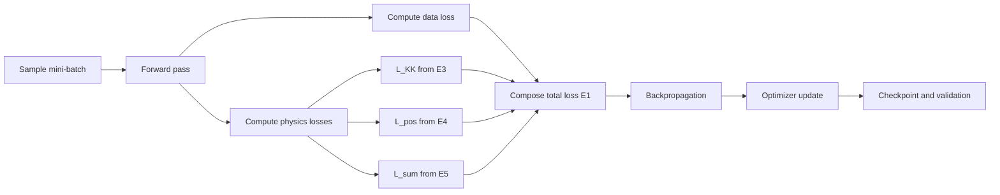
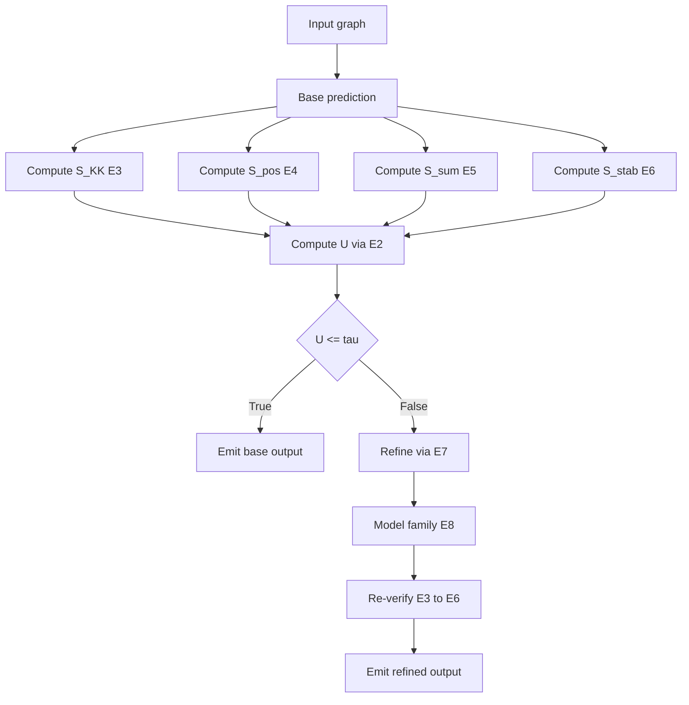
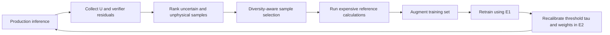

# REPORT_PLAN_V4: Physics-Grounded Plan for Tiny-Data Spectral Learning

**Project:** Electron-GNN  
**Date:** 2026-04-07  
**Scope:** V4 design plan derived from the full method and paper sweep done in this session

---

## 1. Executive Summary

This report proposes V4 as a **predictor + verifier + constrained refiner** system, instead of only a larger neural model.

Why this direction is preferred for current constraints:

1. Data is very limited, so unconstrained extrapolation is fragile.
2. The target is a physical spectrum, so causality, positivity, and sum-rule style checks are available and should be used.
3. Rational or pole-based refiners can improve out-of-distribution behavior with low parameter count.

The resulting V4 stack is:

1. Fast base predictor (builds on V3 two-tower strengths).
2. Physics verifier stack (causality, positivity, budget checks, stability checks).
3. Constrained refiner (rational/pole model projection when verifier risk is high).

---

## 2. Research Coverage and Main Takeaways

### 2.1 Causality and Kramers-Kronig constraints

- Core idea: for linear response systems, real and imaginary parts are Hilbert-transform coupled.
- Use: convert this into a numerical consistency score for each predicted spectrum.
- Value for V4: strong post-hoc physical validity test with no extra labels.

References: [R1], [R2]

### 2.2 Oscillator strength and TRK-style global checks

- Core idea: oscillator strengths follow global sum constraints (Thomas-Reiche-Kuhn class constraints).
- Use: enforce and monitor integrated spectral strength budget.
- Value for V4: catches globally wrong but locally smooth predictions.

References: [R3], [R8]

### 2.3 Prony, Matrix Pencil, and GPOF family

- Core idea: represent signal/spectrum with a small number of damped modes.
- Use: infer poles/modes for extrapolation and denoising.
- Value for V4: better extrapolation under tiny-data regimes compared to unconstrained direct decoding.

References: [R4], [R5], [R6]

### 2.4 Vector Fitting (stable rational approximation)

- Core idea: fit transfer/spectral response with stable rational model.
- Use: perform constrained refinement step with stable poles.
- Value for V4: practical numerical path to robust and interpretable refinement.

References: [R7]

### 2.5 Excited-state ML constraints under data scarcity

- Core idea: for excited-state ML, reliability depends heavily on data quality, phase handling, and active learning around uncertainty.
- Use: uncertainty-triggered re-computation and targeted sampling around verifier failures.
- Value for V4: turns verification residuals into data acquisition strategy.

References: [R8], [R9], [R10]

---

## 3. Proposed V4 System Architecture

### 3.1 High-level architecture



### 3.2 Operational diagram (non-mermaid)

```text
Input graph
  -> Base prediction (fast)
  -> Physical checks (causality, positivity, budget, stability)
  -> If trusted: return
  -> If not trusted: constrained projection/refinement
  -> Re-check and return with trust score
```

---

## 4. Physics Verifier Stack

Let predicted absorption-like response be \(A(\omega)\) over a frequency grid.

### 4.1 Kramers-Kronig/Hilbert consistency

For linear response function \(\chi(\omega)\):

$$
\Re\chi(\omega) = \frac{1}{\pi}\,\mathrm{PV}\int_{-\infty}^{\infty}\frac{\Im\chi(\omega')}{\omega' - \omega}\,d\omega'
$$

$$
\Im\chi(\omega) = -\frac{1}{\pi}\,\mathrm{PV}\int_{-\infty}^{\infty}\frac{\Re\chi(\omega')}{\omega' - \omega}\,d\omega'
$$

Discrete verifier score:

$$
S_{KK} = \frac{\|\Re\chi - \mathcal{H}[\Im\chi]\|_2}{\|\Re\chi\|_2 + \epsilon}
$$

References: [R1], [R2]

### 4.2 Positivity/passivity check

$$
S_{pos} = \frac{1}{N}\sum_{i=1}^{N} \max(0, -A(\omega_i))
$$

Interpretation: zero is ideal, larger values indicate physically implausible negative absorption regions.

### 4.3 Integrated strength (TRK-inspired) check

Canonical form:

$$
\sum_n f_{0n} = N_e
$$

Practical V4 proxy on finite grid or finite peaks:

$$
S_{sum} = \frac{|\hat{F} - F_{ref}|}{F_{ref} + \epsilon}
$$

where \(\hat{F}\) is predicted total strength and \(F_{ref}\) is molecule-specific expected budget from training statistics or theory anchor.

References: [R3], [R8]

### 4.4 Pole stability check (if rational/pole form is used)

For poles \(p_k\), enforce:

$$
\Re(p_k) < 0
$$

and define stability violation score:

$$
S_{stab} = \frac{1}{K}\sum_{k=1}^{K} \mathbf{1}[\Re(p_k) \ge 0]
$$

References: [R5], [R7]

### 4.5 Composite trust score

$$
U = w_1 U_{ens} + w_2 S_{KK} + w_3 S_{pos} + w_4 S_{sum} + w_5 S_{stab}
$$

Lower is better. This score gates whether refinement is required.

---

## 5. Constrained Refiner Design

### 5.1 Rational model form (Vector Fitting style)

$$
H(s) = d + s e + \sum_{k=1}^{K}\frac{r_k}{s - p_k}
$$

with constraints on pole stability and optional positivity/passivity penalties.

Reference: [R7]

### 5.2 Pole/mode model form (Prony/Matrix Pencil style)

$$
y_n = \sum_{k=1}^{K} c_k z_k^n
$$

or continuous counterpart:

$$
y(t) = \sum_{k=1}^{K} a_k e^{s_k t}
$$

References: [R4], [R5], [R6]

### 5.3 Constrained projection objective

Given raw prediction \(A_{raw}(\omega)\), solve:

$$
\begin{aligned}
\theta^* = \arg\min_{\theta} \Big(&\|A_{raw} - A_{model}(\omega;\theta)\|_2^2 \\
&+ \lambda_{KK}S_{KK}(\theta) \\
&+ \lambda_{pos}S_{pos}(\theta) \\
&+ \lambda_{sum}S_{sum}(\theta)\Big)
\end{aligned}
$$

subject to stability and bounded-parameter constraints.

---

## 6. Training Objective for V4

Base model loss with soft physics penalties:

$$
\begin{aligned}
\mathcal{L} =\;& \mathcal{L}_{data} \\
&+ \lambda_{KK}\mathcal{L}_{KK} \\
&+ \lambda_{pos}\mathcal{L}_{pos} \\
&+ \lambda_{sum}\mathcal{L}_{sum} \\
&+ \lambda_{smooth}\mathcal{L}_{smooth}
\end{aligned}
$$

Practical guidance:

1. Start with low \(\lambda\) values to avoid destabilizing early training.
2. Increase \(\lambda\) after base convergence.
3. Keep verifier stack active even if penalties are in training.

---

## 7. Inference-Time Decision Logic



---

## 8. Data-Efficient Active Learning Loop

Use verifier failures to choose new expensive reference points.

Policy:

1. Rank samples by \(U\), \(S_{KK}\), and \(S_{sum}\).
2. Select top-risk samples with diversity constraint.
3. Recompute references for only selected samples.
4. Retrain and repeat.

This aligns with excited-state ML recommendations on adaptive sampling and uncertainty-driven expansion.

References: [R8], [R10]

---

## 9. Planned Ablation Matrix

| ID | Model variant | Verifiers | Refiner | Expected value |
|---|---|---|---|---|
| A0 | V3 baseline | No | No | Current reference point |
| A1 | V4-base | No | No | Measure architecture-only gain |
| A2 | V4-base + checks | Yes | No | Reliability diagnostics without correction |
| A3 | V4-base + rational refiner | Minimal | Yes | Extrapolation gain |
| A4 | V4-base + full verifier + refiner | Yes | Yes | Main candidate |
| A5 | A4 + physics loss terms | Yes | Yes | End-to-end physics regularization |

Metrics:

1. Frequency MAE, amplitude MAE, overlap.
2. Physics violation metrics: \(S_{KK}, S_{pos}, S_{sum}, S_{stab}\).
3. Calibration: trust score vs true error.

---

## 10. Implementation Roadmap



---

## 11. Suggested Repository Deliverables

Proposed files/modules to add in V4 implementation phase:

1. `utils/physics_verifiers.py`
2. `utils/rational_refiner.py`
3. `train/losses_v4.py`
4. `scripts/evaluate_v4.py`
5. `docs/REPORT_PLAN_V4.md` (this file)

---

## 12. Risks and Mitigations

1. **Risk:** Over-constraining training harms fit quality.  
   **Mitigation:** delayed/scheduled physics penalty weights.

2. **Risk:** Rational refiner instability for poor initialization.  
   **Mitigation:** warm-start from base peaks and cap model order.

3. **Risk:** Verifier false positives on edge cases.  
   **Mitigation:** calibrate thresholds per molecule class and keep manual override.

4. **Risk:** Tiny dataset still misses rare regimes.  
   **Mitigation:** verifier-driven active learning and diversity-constrained sample selection.

---

## 13. References

[R1] Kramers-Kronig relations, Wikipedia.  
URL: https://en.wikipedia.org/wiki/Kramers%E2%80%93Kronig_relations

[R2] Lucarini et al., "Kramers-Kronig Relations and Sum Rules in Linear Optical Spectroscopy" (summary and context page).  
URL: https://arxiv.org/abs/1107.0071

[R3] Oscillator strength and TRK context, Wikipedia.  
URL: https://en.wikipedia.org/wiki/Oscillator_strength

[R4] Prony's method, Wikipedia.  
URL: https://en.wikipedia.org/wiki/Prony%27s_method

[R5] Matrix pencil method, Wikipedia (method summary and canonical formulation).  
URL: https://en.wikipedia.org/wiki/Matrix_pencil

[R6] Y. Hua and T. K. Sarkar, "Matrix Pencil Method for Estimating Parameters of Exponentially Damped/Undamped Sinusoids in Noise," IEEE Transactions on Acoustics, Speech, and Signal Processing, 1990. (open abstract mirrors were reviewed in-session)

[R7] SINTEF Vector Fitting project page with original references to B. Gustavsen and A. Semlyen (1999, 2006).  
URL: https://www.sintef.no/projectweb/vectorfitting/

[R8] J. Westermayr and P. Marquetand, "Machine Learning for Electronically Excited States of Molecules," Chem. Rev. (open article).  
URL: https://pmc.ncbi.nlm.nih.gov/articles/PMC8391943/

[R9] A. V. Akimov, "A Simple Phase correction Makes a Big Difference in Nonadiabatic Molecular Dynamics," J. Phys. Chem. Lett., 2018.  
DOI: https://doi.org/10.1021/acs.jpclett.8b02826

[R10] P. O. Dral, M. Barbatti, and W. Thiel, "Nonadiabatic Excited-State Dynamics with Machine Learning," J. Phys. Chem. Lett., 2018.  
DOI: https://doi.org/10.1021/acs.jpclett.8b02656

---

## 14. Actionable Next Step

Implement V4 in this order:

1. Physics verifiers (fastest gain, low risk).
2. Constrained refiner (extrapolation and robustness gain).
3. Physics-regularized training objective.
4. Active-learning loop driven by verifier residuals.

---

## 15. End-to-End V4 Pipeline: Labeled Flow Diagrams and Equations

### 15.1 Equation Label Registry

This subsection defines the canonical equation labels used in the diagrams.

**(E1) Training objective**

$$
\begin{aligned}
\mathcal{L} =\;& \mathcal{L}_{data} \\
&+ \lambda_{KK}\mathcal{L}_{KK} \\
&+ \lambda_{pos}\mathcal{L}_{pos} \\
&+ \lambda_{sum}\mathcal{L}_{sum} \\
&+ \lambda_{smooth}\mathcal{L}_{smooth}
\end{aligned}
$$

**(E2) Composite trust score**

$$
U = w_1 U_{ens} + w_2 S_{KK} + w_3 S_{pos} + w_4 S_{sum} + w_5 S_{stab}
$$

**(E3) Kramers-Kronig consistency score**

$$
S_{KK} = \frac{\|\Re\chi - \mathcal{H}[\Im\chi]\|_2}{\|\Re\chi\|_2 + \epsilon}
$$

**(E4) Positivity score**

$$
S_{pos} = \frac{1}{N}\sum_{i=1}^{N} \max(0, -A(\omega_i))
$$

**(E5) Integrated-strength score**

$$
S_{sum} = \frac{|\hat{F} - F_{ref}|}{F_{ref} + \epsilon}
$$

**(E6) Stability violation score**

$$
S_{stab} = \frac{1}{K}\sum_{k=1}^{K} \mathbf{1}[\Re(p_k) \ge 0]
$$

**(E7) Constrained projection/refinement**

$$
\begin{aligned}
\theta^* = \arg\min_{\theta} \Big(&\|A_{raw} - A_{model}(\omega;\theta)\|_2^2 \\
&+ \lambda_{KK}S_{KK}(\theta) \\
&+ \lambda_{pos}S_{pos}(\theta) \\
&+ \lambda_{sum}S_{sum}(\theta)\Big)
\end{aligned}
$$

**(E8) Rational spectral model**

$$
H(s) = d + s e + \sum_{k=1}^{K}\frac{r_k}{s - p_k}
$$

### 15.2 End-to-End System Flow (Training + Inference + Feedback)



### 15.3 Training Pipeline Diagram (Equation-Labeled)



### 15.4 Inference Decision Diagram (Verifier and Refiner)



### 15.5 Active-Learning Closed Loop Diagram



### 15.6 Stage-to-Equation Mapping Table

| Pipeline Stage | Primary Equation Labels | Purpose |
|---|---|---|
| Training objective composition | E1 | Fit data while enforcing physics priors |
| Verifier: causality | E3 | Penalize Hilbert inconsistency |
| Verifier: positivity | E4 | Penalize negative absorption regions |
| Verifier: global strength | E5 | Enforce integral budget consistency |
| Verifier: stability | E6 | Reject unstable pole structures |
| Trust aggregation | E2 | Single scalar for decision gating |
| Refinement solve | E7 | Project raw output to constrained manifold |
| Refiner model class | E8 | Stable, interpretable spectral representation |
