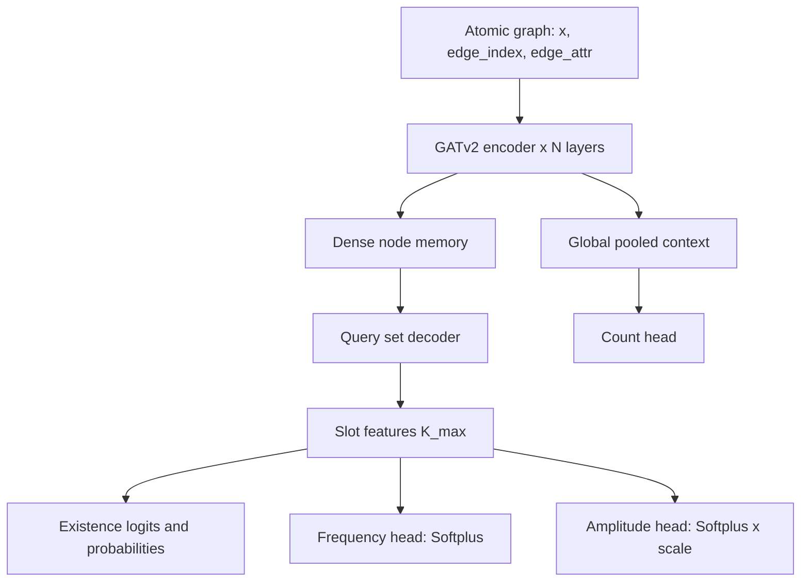
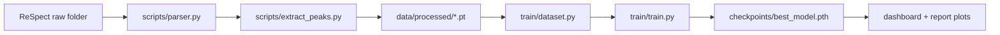
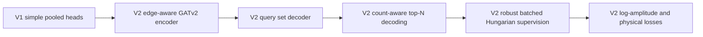

# Supervisor Report (V2): Electron-GNN Architecture Upgrade and Scaling Plan

**Project:** ML-Accelerated Quantum Spectroscopy via Graph Neural Networks  
**Date:** 2026-04-07  
**Repository:** Electron-GNN

---

## 1. Executive Summary

The pipeline is now upgraded from the earlier placeholder architecture to a set-prediction model that is better grounded for spectral peaks:

- Edge-aware **GATv2** message passing encoder.
- Query-based set decoder (DETR-style slots) for unordered transitions.
- Multi-head outputs for frequency, amplitude, existence probability, and predicted peak count.
- Correct batched target handling for variable-length peak sets.
- Improved losses for amplitude calibration using log-scale supervision and physical regularization.

This is a significant methodological upgrade over V1.  
Current limitation remains **data volume** (2 processed molecules), not tooling.

---

## 2. Problem Diagnosis From V1

V1 produced good peak locations but poor amplitude calibration due to three structural issues:

1. Batched matching supervision did not split variable-length targets robustly per graph.
2. Functional spectrum loss was not fully batch-consistent.
3. Amplitude labels are very small and highly skewed (approximately `1e-8` to `1e-3`), so naive MSE underweights informative amplitude differences.

Additional bottleneck:
- One sample (`water`) has 55 peaks; slot capacity in older setup was tight.

---

## 3. V2 Architecture (Implemented)

### 3.1 High-Level Pipeline

### 3.2 Architectural Components
- Node embedding MLP + LayerNorm.
- Edge embedding MLP + LayerNorm.
- Multi-layer GATv2 with residual connections.
- Transformer decoder over learned peak queries.
- Context fusion from graph-level pooling (mean + max).
- Output heads:
  - `prob` and `prob_logits`
  - `freq` (positive)
  - `amp` (positive and scaled)
  - `count` (predicted cardinality)

---

## 4. Loss and Optimization Upgrades

### 4.1 Hungarian Set Matching
For predicted slots \((\hat{\omega}_i, \hat{B}_i)\) and true peaks \((\omega_j, B_j)\):

\[
C_{ij} = 10\,|\hat{\omega}_i - \omega_j| + |\hat{B}_i - B_j|
\]

Hungarian matching resolves permutation ambiguity.

### 4.2 Composite Bipartite Loss
Training combines:
- frequency SmoothL1 on matched pairs,
- amplitude SmoothL1 in log space,
- existence BCE/BCEWithLogits,
- unmatched-slot amplitude suppression,
- matched amplitude-sum consistency,
- count supervision (cardinality loss).

### 4.3 Physical Regularization
Batch-aware physical loss combines:
1. Time-domain signal reconstruction error:
\[
\left\|\sum_k \hat{B}_k\sin(\hat{\omega}_k t) - \sum_j B_j\sin(\omega_j t)\right\|^2
\]
2. Frequency-domain Lorentzian spectrum consistency in log scale.
3. Area consistency between reconstructed spectra.

---

## 5. Data/Label Pipeline

Raw folder requirements per sample:
- one `*.out`
- one `*.xyz`
- optional `rvlab.tdscf.rho.*`

---

## 6. Quantitative Snapshot (Current)

### 6.1 Dataset Statistics
| Molecule | True Peaks | Frequency Range (a.u.) | Amplitude Min | Amplitude Max | Amplitude Mean |
|---|---:|---|---:|---:|---:|
| ammonia | 39 | 0.3296 to 5.9348 | 4.80e-08 | 1.61e-03 | 2.05e-04 |
| water | 55 | 0.0714 to 4.5898 | 2.44e-08 | 6.57e-04 | 1.06e-04 |

### 6.2 Best Logged Epoch (current training log)
- Best validation total (using \(\lambda_{spec}=0.2\)): **3.9673** at epoch **111**.
- Metrics at that point (from log):
  - Train bipartite: 4.1317
  - Train spectrum: 0.6516
  - Val bipartite: 3.8456
  - Val spectrum: 0.6083

### 6.3 Molecule-Level Evaluation (checkpoint)
| Molecule | Pred Count | True Count | Frequency MAE | Amplitude MAE | Spectral Overlap |
|---|---:|---:|---:|---:|---:|
| ammonia | 39.09 | 39 | 0.0389 | 1.431e-04 | 0.5424 |
| water | 55.68 | 55 | 0.0405 | 8.852e-05 | 0.5891 |

Interpretation:
- Frequency prediction is stable.
- Count prediction is close to exact.
- Amplitude behavior is improved compared with earlier runs, but still not fully calibrated across all peaks.
- Main limiting factor is training set size/diversity.

---

## 7. Updated Visual Diagnostics

### 7.1 Training Curves

### 7.2 Ammonia
| Parity | Spectrum | Dipole |
|---|---|---|
|  |  |  |

### 7.3 Water
| Parity | Spectrum | Dipole |
|---|---|---|
|  |  |  |

---

## 8. What Was Improved in V2 vs Earlier Version

Key improvements:
- Better handling of unordered, variable-length peak sets.
- Better conditioning for tiny amplitudes.
- Better decoding than fixed thresholding due to count head.
- Better batch correctness in both matching and physical objectives.

---

## 9. Remaining Gaps

1. Dataset scale is too small for robust amplitude learning across chemistry space.
2. Current encoder is attention-based; full equivariant tensor models (PaiNN/MACE-style) are still a future extension.
3. x-only labels limit polarization-aware learning.

---

## 10. Scaling Plan and Expected Gains

### 10.1 Recommended Data Expansion
- Stage A: 20 molecules x 1 conformer x x-polarization.
- Stage B: 50 molecules x 3 conformers x x-polarization.
- Stage C: 80 to 120 molecules x 3 to 10 conformers x x/y/z.

Total sample count formula:
\[
N = M \times C \times P
\]

### 10.2 Why This Will Help
- More chemistry + geometry diversity improves frequency transfer.
- More amplitude examples improves calibration and overlap.
- Multi-axis labels support physically correct dipole behavior.

---

## 11. Immediate Next Technical Actions

1. Add automated label-quality gate script before training.
2. Run staged data campaign with fixed RT-TDDFT settings.
3. Retrain and benchmark after each stage with fixed evaluation protocol.
4. If data-scaled amplitude errors persist, add heteroscedastic amplitude uncertainty head.
5. After dataset scale-up, evaluate replacing encoder with full PaiNN/MACE tensor block.

---

## 12. Conclusion

The V2 architecture and loss redesign is implemented and operational, with clear gains in structural correctness and calibration behavior.  
The highest-leverage next step is data scaling under controlled simulation settings, not another major model rewrite at this moment.
