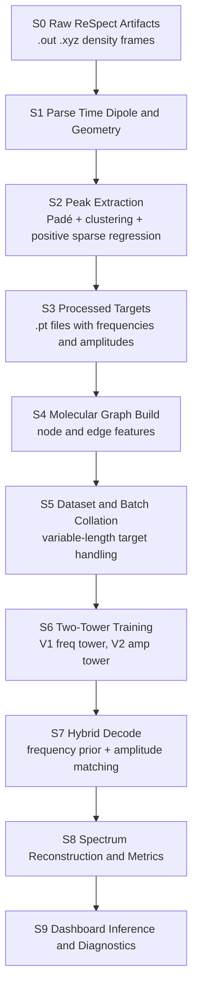

# V3 End-to-End Technical Report (Raw Data to Inference)

## 1. Scope and Goal

This report documents the full V3 pipeline used in this repository, from raw ReSpect outputs to final peak-set inference. It is implementation-aligned and equation-driven.

Pipeline objective:
- Input: molecular geometry and real-time dipole response traces.
- Output: unordered transition set
  - frequencies: $\{\omega_k\}$
  - amplitudes: $\{B_k\}$
- Derived output: reconstructed absorption-like spectrum via Lorentzian superposition.

Reference implementation files:
- `scripts/parser.py`
- `scripts/extract_peaks.py`
- `models/molecule_graph.py`
- `train/dataset.py`
- `models/mace_net_v1.py`
- `models/mace_net.py`
- `train/losses.py`
- `train/train_v3_two_tower.py`
- `utils/hybrid_inference.py`
- `scripts/evaluate_two_tower.py`

## 2. Labeled Pipeline Map



Stage labels used below:
- Stage S0 to S9 correspond to the Mermaid nodes above.

## 3. Symbol Table

| Symbol | Meaning | Shape / Domain |
|---|---|---|
| $N$ | Number of atoms in molecule | integer |
| $K$ | Number of decoder slots (`K_max`) | integer |
| $K_{true}$ | True number of transitions for a sample | integer |
| $\mathbf{x}_i$ | Node feature for atom $i$ | $\mathbb{R}^{F_n}$ |
| $\mathbf{r}_i$ | Atom position (a.u.) | $\mathbb{R}^3$ |
| $\mathcal{E}$ | Edge set under cutoff radius | set |
| $p_k$ | Peak existence probability for slot $k$ | $[0,1]$ |
| $\omega_k$ | Predicted transition frequency | $\mathbb{R}_{>0}$ |
| $B_k$ | Predicted transition amplitude magnitude | $\mathbb{R}_{\ge 0}$ |
| $\hat{K}$ | Predicted count from count head | $\mathbb{R}_{\ge 0}$ |
| $S(\omega)$ | Lorentzian-reconstructed spectrum | $\mathbb{R}_{\ge 0}$ |
| $\gamma$ | Lorentzian broadening constant | scalar |

## 4. Stage S0-S1: Raw Parsing

### 4.1 Time dipole parsing

`parse_respect_out` reads lines with `Step EAS:` and extracts:
- time $t_n$
- dipole components $\mu_x(t_n), \mu_y(t_n), \mu_z(t_n)$

Discrete trace per axis:
$$
\mu_a = [\mu_a(t_0), \mu_a(t_1), \dots, \mu_a(t_{T-1})], \quad a \in \{x,y,z\}.
$$

### 4.2 Geometry parsing

`parse_respect_xyz` extracts:
- atomic numbers $Z_i$
- positions $\mathbf{r}_i = (x_i, y_i, z_i)$ in atomic units

These become graph inputs later.

## 5. Stage S2: Peak Extraction (Physics-Guided Spectral Decomposition)

`scripts/extract_peaks.py` wraps `BroadbandDipole` from the HyQD/absorption-spectrum library.

Conceptually, the dipole response is approximated by sparse transition contributions:
$$
\mu_x(t) \approx \sum_{k=1}^{K_{cand}} B_k \sin(\omega_k t), \quad B_k \ge 0,
$$
where candidate frequencies come from Padé-based rational analysis and are pruned by sparse positive regression.

Active transitions are thresholded in code by:
$$
B_k > 10^{-8}.
$$

Saved target fields per molecule:
- `frequencies`: active $\omega_k$
- `amplitudes_x`: active $B_k$ for x-polarized excitation

## 6. Stage S3-S4: Graph Construction

### 6.1 Node features

In `models/molecule_graph.py`, atoms are encoded by one-hot over `[H, C, N, O, F]`:
$$
\mathbf{x}_i = \text{onehot}(Z_i) \in \{0,1\}^{5}.
$$

### 6.2 Edge construction

Directed edges are added for all pairs $(i,j), i \ne j$ within cutoff radius $r_c$:
$$
(i,j) \in \mathcal{E} \iff \|\mathbf{r}_i - \mathbf{r}_j\|_2 \le r_c,
$$
with default $r_c=5.0$.

### 6.3 Edge features

Edge feature vector is:
$$
\mathbf{e}_{ij} = [d_{ij},\; (\mathbf{r}_i-\mathbf{r}_j)_x,\; (\mathbf{r}_i-\mathbf{r}_j)_y,\; (\mathbf{r}_i-\mathbf{r}_j)_z],
$$
$$
 d_{ij} = \|\mathbf{r}_i - \mathbf{r}_j\|_2.
$$

## 7. Stage S5: Dataset Collation and Variable-Length Targets

`train/dataset.py` attaches targets to each graph `Data` object:
- `y_freq`: shape $(K_{true},)$
- `y_amp`: shape $(K_{true},)$
- `num_peaks`: scalar count for robust batch splitting

When batching graphs, target vectors are flattened by PyG; losses reconstruct per-graph segments via `num_peaks`.

## 8. Stage S6A: Frequency Tower (V1) Model and Loss

Model: `SpectralEquivariantGNNV1` (`models/mace_net_v1.py`).

Outputs per sample:
- $\mathbf{p}^{(f)} \in [0,1]^K$
- $\boldsymbol\omega^{(f)} \in \mathbb{R}_{>0}^K$
- auxiliary amplitudes (not used as final hybrid amplitudes)

### 8.1 Assignment for frequency supervision

For predicted slots and true frequencies, cost matrix:
$$
C^{(f)}_{ij} = |\omega^{(f)}_i - \omega^{(t)}_j|.
$$
Hungarian assignment gives matched pairs $\mathcal{M}$.

### 8.2 Frequency tower loss

Implemented in `frequency_tower_loss`:
$$
\mathcal{L}_{freq} = 12\,\mathcal{L}_\omega + 1\,\mathcal{L}_{prob} + 0.3\,\mathcal{L}_{count} + 0.02\,\mathcal{L}_{unmatched}.
$$

Terms:
- Matched frequency regression (Smooth L1):
$$
\mathcal{L}_\omega = \text{SmoothL1}(\omega^{(f)}_{\mathcal{M}}, \omega^{(t)}_{\mathcal{M}}).
$$
- Slot occupancy BCE:
$$
\mathcal{L}_{prob} = \text{BCE}(\mathbf{p}^{(f)}, \mathbf{y}_{slot}).
$$
- Count calibration:
$$
\mathcal{L}_{count} = \text{SmoothL1}\left(\sum_{k=1}^{K} p^{(f)}_k, K_{true}\right).
$$
- Unmatched spike suppression:
$$
\mathcal{L}_{unmatched} = \frac{1}{|\bar{\mathcal{M}}|}\sum_{k\in \bar{\mathcal{M}}}(\omega^{(f)}_k)^2.
$$

Optional teacher regularization is also available for high-capacity retraining.

## 9. Stage S6B: Amplitude Tower (V2 Core) Model and Loss

Model: `SpectralEquivariantGNN` (`models/mace_net.py`), used as amplitude tower.

### 9.1 Encoder-decoder structure

1) Node and edge embedding:
$$
\mathbf{h}_i^{(0)} = \phi_n(\mathbf{x}_i), \quad \mathbf{g}_{ij} = \phi_e(\mathbf{e}_{ij}).
$$

2) Multi-layer GATv2 message passing with residual:
$$
\mathbf{h}_i^{(\ell+1)} = \text{GELU}(\text{LN}(\text{GATv2}^{(\ell)}(\mathbf{h}^{(\ell)}, \mathbf{g}))) + \mathbf{h}_i^{(\ell)}.
$$

3) DETR-style set decoder with learned query slots $\mathbf{q}_k$:
$$
\mathbf{s}_k = \text{Decoder}(\mathbf{q}_k, \text{dense}(\mathbf{h})).
$$

4) Heads:
$$
p_k = \sigma(f_{prob}(\mathbf{s}_k)),
$$
$$
\omega_k = \text{Softplus}(f_{freq}(\mathbf{s}_k)) + 10^{-5},
$$
$$
B_k = \text{Softplus}(f_{amp}(\mathbf{s}_k))\cdot s_{amp},
$$
$$
\hat{K} = \text{Softplus}(f_{count}(\mathbf{c}_{global})).
$$

### 9.2 Bipartite set loss (amplitude tower)

From `train/losses.py`, matching cost:
$$
C_{ij} = 10|\omega_i-\omega^{(t)}_j| + |B_i - B^{(t)}_j|.
$$

Loss:
$$
\mathcal{L}_{bip} = 8\mathcal{L}_{\omega} + 8\mathcal{L}_{amp} + 1.2\mathcal{L}_{prob} + 1.0\mathcal{L}_{unmatched\_amp} + 6.0\mathcal{L}_{sum} + 0.5\mathcal{L}_{count}.
$$

Log-scale amplitude regression:
$$
\mathcal{L}_{amp} = \text{SmoothL1}(\log(1+\alpha B_{pred}),\log(1+\alpha B_{true})),\; \alpha=10^4.
$$

### 9.3 Auto-differential spectrum regularizer

Composite term:
$$
\mathcal{L}_{spec\_auto} = \mathcal{L}_{time} + 0.5\mathcal{L}_{spec} + 0.5\mathcal{L}_{area}.
$$

Time-domain reconstruction:
$$
\hat{d}(t) = \sum_k (p_k B_k)\sin(\omega_k t), \quad d(t) = \sum_j B^{(t)}_j\sin(\omega^{(t)}_j t),
$$
$$
\mathcal{L}_{time} = \text{MSE}(\hat{d}(t), d(t)).
$$

Frequency-domain Lorentzian comparison:
$$
S(\omega) = \sum_k \frac{B_k\gamma}{(\omega-\omega_k)^2+\gamma^2},
$$
$$
\mathcal{L}_{spec} = \text{MSE}(\log(1+\beta \hat{S}(\omega)),\log(1+\beta S_t(\omega))),\; \beta=5\times10^3.
$$

Total amplitude training objective:
$$
\mathcal{L}_{amp\_tower} = \mathcal{L}_{bip} + \lambda_{spec}\mathcal{L}_{spec\_auto}, \quad \lambda_{spec}=0.3.
$$

## 10. Stage S6C: V3 Training Protocol

From `train/train_v3_two_tower.py`:

1) Deterministic split:
- configurable `val_ratio` (default 0.5)
- ensures at least one train sample and one val sample when possible.

2) Frequency tower:
- optional retrain (`epochs_freq`)
- warmup freeze/unfreeze and optional teacher slot anchoring.

3) Amplitude tower:
- initialized from `checkpoints/best_model.pth`
- checkpoint selection uses decode-quality score on validation set:
$$
Q = \text{overlap} - 0.25\cdot\text{count\_error},
$$
$$
\text{count\_error}=\frac{|K_{pred}-K_{true}|}{\max(1,K_{true})}.
$$

4) Early stop:
- controlled by `amp_early_stop_patience`.

## 11. Stage S7: Hybrid Decode (Production V3 Inference)

Core implementation: `combine_two_tower_predictions` in `utils/hybrid_inference.py`.

### 11.1 Frequency source

Primary frequencies come from V1 frequency tower ranked by confidence and target cardinality estimate.

### 11.2 Amplitude source

Amplitudes come from amplitude tower by confidence-aware one-to-one assignment.

Assignment cost:
$$
C^{(hyb)}_{ij} = |\omega^{(f)}_i - \omega^{(a)}_j| + \lambda_c(1-p^{(a)}_j),\quad \lambda_c=0.05.
$$

### 11.3 Overflow extension (new in this cycle)

If desired cardinality exceeds available selected V1 slots, additional candidate frequencies are borrowed from amplitude tower, constrained by minimum separation:
$$
\min_{m\in\mathcal{S}}|\omega_{cand} - \omega_m| \ge \delta_{min}.
$$

Default tuned value:
$$
\delta_{min}=0.005.
$$

### 11.4 Hybrid confidence

Final confidence combines both towers conservatively:
$$
p^{(hyb)}_k = \min\big(p^{(f)}_k, p^{(a)}_{\pi(k)}\big).
$$

## 12. Stage S8: Evaluation Metrics

From `scripts/evaluate_two_tower.py`:

### 12.1 Matched MAE

Using Hungarian assignment with combined cost:
$$
C_{ij}=10|\omega_i-\omega^{(t)}_j|+|B_i-B^{(t)}_j|.
$$

Then:
$$
\text{Freq-MAE}=\frac{1}{|\mathcal{M}|}\sum_{(i,j)\in\mathcal{M}}|\omega_i-\omega^{(t)}_j|,
$$
$$
\text{Amp-MAE}=\frac{1}{|\mathcal{M}|}\sum_{(i,j)\in\mathcal{M}}|B_i-B^{(t)}_j|.
$$

### 12.2 Spectral overlap

With reconstructed spectra on shared frequency grid:
$$
\text{Overlap}=\frac{\langle S_{pred}, S_{true}\rangle}{\|S_{pred}\|_2\,\|S_{true}\|_2+\epsilon}.
$$

## 13. Fresh Retrain Results (2026-04-08)

### 13.1 Training run summary

Command used:

```bash
/home/user/Electron-GNN/EGNN/bin/python -m train.train_v3_two_tower \
  --data_dir data/processed \
  --epochs_freq 0 \
  --epochs_amp 60 \
  --batch_size 1 \
  --val_ratio 0.5 \
  --amp_early_stop_patience 12 \
  --save_dir checkpoints \
  --log_file results/v3_train_output.log \
  --init_freq_ckpt checkpoints/best_model_v1.pth \
  --init_amp_ckpt checkpoints/best_model.pth
```

Observed:
- split: train=1, val=1
- amplitude training early-stopped at epoch 28
- best validation quality checkpoint reached around epoch 16 with quality 0.5473

### 13.2 Post-train checkpoint comparison

Baseline amplitude checkpoint (`checkpoints/best_model.pth`) remained superior in hybrid mode on current tiny dataset.

At decode defaults (`prob_threshold=0.65`, `fallback_topk=8`, overflow enabled):
- Hybrid average overlap with baseline amp: 0.5698
- Hybrid average overlap with retrained amp (`checkpoints/v3_amp_tower.pth`): 0.4811

Conclusion:
- Keep `checkpoints/best_model.pth` as production amplitude tower for now.
- Keep retrained checkpoint as experimental artifact.

### 13.3 Decode tuning summary

Sweep over `hybrid_min_freq_separation` with baseline amp:
- best overlap regime: 0.003 to 0.005 (equal best observed overlap 0.5698)
- larger separation (0.01 to 0.02) reduced overlap
- overflow disabled reduced peak coverage on water (pred 50 vs true 55)

Recommended decode configuration:
- `prob_threshold = 0.65`
- `fallback_topk = 8`
- `allow_amp_overflow = true`
- `min_freq_separation = 0.005`

## 14. Stage S9: End-to-End Reproducible Command Chain

### Cmd-A: Parse and extract physical peaks from raw data

```bash
/home/user/Electron-GNN/EGNN/bin/python scripts/extract_peaks.py
```

Output:
- processed targets in `data/processed/*.pt`

### Cmd-B: Train V3 two-tower

```bash
/home/user/Electron-GNN/EGNN/bin/python -m train.train_v3_two_tower \
  --data_dir data/processed \
  --epochs_freq 0 \
  --epochs_amp 60 \
  --batch_size 1 \
  --val_ratio 0.5 \
  --amp_early_stop_patience 12 \
  --save_dir checkpoints \
  --log_file results/v3_train_output.log \
  --init_freq_ckpt checkpoints/best_model_v1.pth \
  --init_amp_ckpt checkpoints/best_model.pth
```

### Cmd-C: Evaluate V1/V2/Hybrid

```bash
/home/user/Electron-GNN/EGNN/bin/python scripts/evaluate_two_tower.py \
  --data_dir data/processed \
  --v1_ckpt checkpoints/best_model_v1.pth \
  --v2_ckpt checkpoints/best_model.pth \
  --prob_threshold 0.65 \
  --fallback_topk 8 \
  --hybrid_min_freq_separation 0.005
```

### Cmd-D: Launch dashboard inference

```bash
streamlit run dashboard/app.py
```

## 15. Known Constraints and Next Scaling Step

Current bottleneck is dataset size, not model wiring:
- processed molecules currently: 2
- strongly limits robustness of amplitude retraining and model ranking

Most impactful next step:
- add chemically diverse molecules and maintain same S0-S9 pipeline for larger-scale retraining and robust checkpoint selection.
