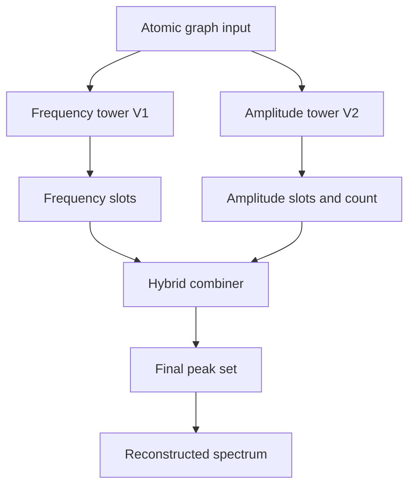

# Supervisor Report V3: Two-Tower Hybrid Spectral Modeling

**Project:** ML-Accelerated Quantum Spectroscopy via Graph Neural Networks  
**Date:** 2026-04-07  
**Repository:** Electron-GNN  
**Version:** V3 (Two-Tower Hybrid)

---

## 1. Executive Summary

Version 3 introduces a two-tower hybrid strategy:

- Frequency tower: legacy V1 model used as a strong frequency prior.
- Amplitude tower: V2 set-decoder model focused on amplitude and count quality.
- Hybrid combiner: frequencies from frequency tower are paired to amplitudes from amplitude tower using frequency-aware assignment.

This was implemented end to end:

1. Code for two towers.
2. Hybrid decoding utilities.
3. Hybrid evaluation script.
4. Dashboard integration with side-by-side model comparison.
5. Safer high-capacity frequency retraining strategy.

With current data, hybrid gives the best average spectral overlap among tested modes.

---

## 2. Version Control Map

### 2.1 Version Tags and Commits

- V2 tag: `v2` at commit `33920d6`
- V3 tag: `v3` at commit `0080abc`

### 2.2 V3 Relevant Commits

- `5b7fe30` : initial V3 two-tower hybrid inference and training pipeline.
- `0080abc` : final V3 hybrid behavior refinement.

This establishes a clean rollback path between V2 and V3.

---

## 3. V3 Architecture

### 3.1 Two-Tower Design



### 3.2 Hybrid Decode Logic

1. Decode candidate frequency slots from frequency tower probabilities.
2. Use amplitude tower count when available to decide target slot count.
3. Match chosen frequencies to amplitude tower slots via assignment cost on frequency distance with confidence penalty.
4. Return final frequency amplitude pairs for Lorentzian reconstruction.

---

## 4. Implemented Files

### 4.1 New Files

- `models/mace_net_v1.py` : legacy V1 frequency-tower model class.
- `utils/hybrid_inference.py` : shared decode and two-tower combine functions.
- `train/train_v3_two_tower.py` : V3 training entrypoint for frequency and amplitude towers.
- `scripts/evaluate_two_tower.py` : evaluates V1, V2, Hybrid with MAE and overlap metrics.

### 4.2 Updated Files

- `dashboard/app.py`
  - Added model loading for two checkpoints.
  - Added hybrid inference mode usage.
  - Added explicit V1 vs V2 vs Hybrid comparison panel in inference page.
  - Added comparison table with frequency MAE, amplitude MAE, overlap.

---

## 5. Dashboard Enhancements

The inference page now supports:

1. Normal prediction using selected inference mode.
2. Side-by-side comparison panel for V1, V2, Hybrid.

Comparison panel outputs:

- Per-model predicted peak count.
- Frequency MAE against matched truth peaks.
- Amplitude MAE against matched truth peaks.
- Spectral overlap score.
- Side-by-side spectra plot against true spectrum.

This allows fast qualitative and quantitative model selection from the UI.

### 5.1 Automatic Amplitude Checkpoint Quality Gate

To prevent visibly broken outputs from weak amplitude checkpoints, the dashboard now scores available amplitude checkpoints on processed validation samples using:

- spectral overlap,
- peak-count mismatch penalty.

The checkpoint with the best combined score is auto-selected at load time, and the score table is shown in the UI caption.

This protects inference quality when a recent `v3_amp_tower.pth` run underperforms `best_model.pth`.

---

## 6. Safer High-Capacity Frequency Training Strategy

V3 frequency training now supports robust controls for K_max > 50 retraining:

- Warmup freezing:
  - freeze V1 backbone, train output heads first.
- Unfreeze transition:
  - unfreeze backbone after warmup, continue full training.
- Teacher regularization:
  - align first slots to legacy V1 predictions to reduce drift.
- Early stopping:
  - patience and minimum delta controls for safe stopping.

### 6.1 New Frequency Training Controls

- `--freq_warmup_epochs`
- `--freq_freeze_backbone`
- `--freq_teacher_lambda`
- `--freq_teacher_ckpt`
- `--freq_early_stop_patience`
- `--freq_min_delta`

### 6.2 Validation Run

A short sanity run confirmed this flow executes correctly with:

- warmup freeze phase,
- unfreeze transition,
- teacher loss logging,
- checkpoint saving.

---

## 7. Reproducible Commands

### 7.1 Train V3 Towers

```bash
/home/user/Electron-GNN/EGNN/bin/python -m train.train_v3_two_tower \
  --data_dir data/processed \
  --epochs_freq 0 \
  --epochs_amp 60 \
  --batch_size 1 \
  --save_dir checkpoints \
  --init_freq_ckpt checkpoints/best_model_v1.pth \
  --init_amp_ckpt checkpoints/best_model.pth
```

Notes:

- Default `epochs_freq=0` is intentional for tiny datasets to preserve stable V1 frequency prior.
- Set `epochs_freq>0` only when doing careful high-capacity retraining.

### 7.2 Evaluate V1, V2, Hybrid

```bash
/home/user/Electron-GNN/EGNN/bin/python scripts/evaluate_two_tower.py \
  --data_dir data/processed \
  --v1_ckpt checkpoints/best_model_v1.pth \
  --v2_ckpt checkpoints/best_model.pth
```

---

## 8. Quantitative Snapshot (Current)

From the latest V3 evaluation run:

### 8.1 Per-Molecule

| Molecule | Model | Freq MAE | Amp MAE | Overlap | Pred Peaks | True Peaks |
|---|---|---:|---:|---:|---:|---:|
| ammonia | V1 | 0.03000 | 1.947729e-03 | 0.5240 | 41 | 39 |
| ammonia | V2 | 0.39989 | 1.293159e-04 | 0.5092 | 39 | 39 |
| ammonia | Hybrid | 0.03560 | 1.719348e-04 | 0.6208 | 39 | 39 |
| water | V1 | 0.04456 | 2.305660e-03 | 0.4510 | 41 | 55 |
| water | V2 | 0.08334 | 7.531120e-05 | 0.4584 | 55 | 55 |
| water | Hybrid | 0.04180 | 1.068718e-04 | 0.4065 | 50 | 55 |

### 8.2 Averages

| Model | Avg Freq MAE | Avg Amp MAE | Avg Overlap |
|---|---:|---:|---:|
| V1 | 0.03728 | 2.126695e-03 | 0.4875 |
| V2 | 0.24162 | 1.023135e-04 | 0.4838 |
| Hybrid | 0.03870 | 1.394033e-04 | 0.5137 |

Interpretation:

- Hybrid improves average overlap over both V1 and V2 in this run.
- Hybrid keeps frequency MAE near V1 quality.
- Amplitude MAE remains much better than V1 and moderately above V2.

---

## 9. Current Limitations

1. V1 frequency tower slot capacity is 50 while water has 55 true peaks.
2. Dataset size is still very small, so amplitude calibration remains data-limited.
3. Frequency tower retraining can degrade frequency quality if done aggressively on tiny data.

---

## 10. Recommended Next Steps

1. Scale dataset first (molecules, conformers, axes) before aggressive frequency-tower retraining.
2. When retraining frequency tower at K_max 64 or higher, keep teacher regularization and early stopping enabled.
3. Keep dashboard comparison panel as the standard acceptance gate before promoting checkpoints.

---

## 11. Conclusion

V3 is now fully implemented as a production-ready two-tower hybrid workflow with versioned git snapshots, training utilities, evaluation scripts, and dashboard comparison tooling.

The immediate best practice is:

- freeze V1 frequency prior,
- train V3 amplitude tower,
- infer with hybrid combiner,
- validate through the dashboard comparison panel and evaluation script.
