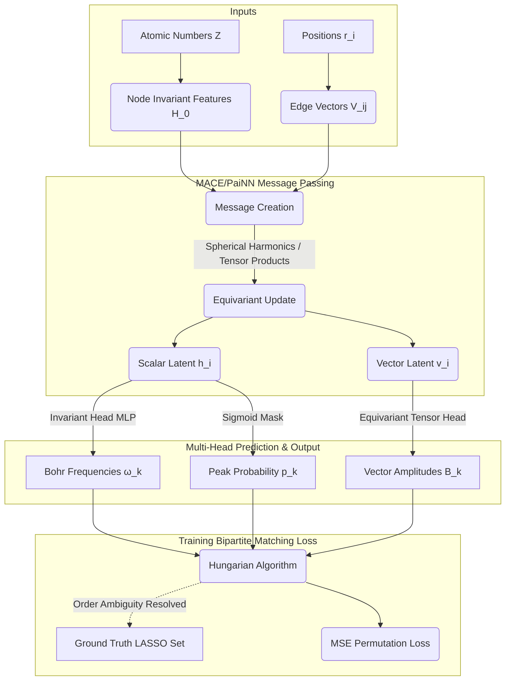

# Extensive Theory and System Architecture Plan
> **ML-Accelerated Quantum Spectroscopy via RT-TDDFT + GNN**

This document serves as the master blueprint for the theory, formulation, implementation reasonings, and advanced architectural choices that will define your project.

---

## 1. Physics Fundamentals: From Hamiltonian to Spectrum

### 1.1 The Dirac-Delta Perturbation
In an equilibrium quantum state (using ReSpect RT-TDDFT), the overall induced electron density $\delta \rho(r,t)$ and induced electronic dipole moment $\mu(t)$ are nearly exactly $0$.

When we apply a weak, instantaneous electric kick $\mathbf{E}(t) = \kappa \cdot \delta(t)$ on the molecule, quantum mechanical superposition states that this excites all transition dipole-allowed states simultaneously. Within the linear response regime (very small $\kappa=0.001$), the exact resulting induced dipole moment $\mu(t)$ is analytically proven to oscillate as a discrete sum of sine waves:

$$ 
\mu_u(t) = c_0^u + \sum_{k=1}^K B_k^u \cdot \sin(\omega_k t) \cdot e^{-\gamma_k t} 
$$

Where:
- $k$ represents an electronic transition from ground state to an excited state.
- $\omega_k$ are the true transition frequencies (energy differences, $E_k - E_0$).
- $B_k^u$ are proportional to the oscillator strengths (the quantum mechanical transition probability amplitudes).
- $u \in \{x, y, z\}$ is the polarization axis.
- $\gamma_k$ is arbitrary broadening/damping (normally $0$, manually added later to construct smooth Lorentzian/Gaussian spectral peaks).

The **absorption spectrum cross-section**, $\sigma(\omega)$, is related to the imaginary part of the trace of the Fourier transform of $\mu(t)$.

### 1.2 The "Curse of Resolution"
According to Fourier theory, the resolution of the final absorption spectrum $\Delta \omega$ is inversely proportional to the maximum simulation time $T = N \cdot \Delta t$:
$$ \Delta \omega = \frac{2\pi}{T} $$
If we brute-force a high-resolution simulation (e.g., $N=30,000$ steps), RT-TDDFT becomes prohibitively expensive at order $O(N_e^3)$ where $N_e$ is the number of electrons.

---

## 2. The Extraction Pipeline: Hauge et al. (2023)
Instead of forcing a neural network to memorize time-series density data, we generate **clean parameter labels $\{\omega_k, B_k\}$** utilizing rigorous signal extraction logic from a short, 2000-step simulation.

### 2.1 Padé Approximant (Locating $\omega_k$)
Taking a short Discrete Fourier Transform creates large truncation errors. The Padé Approximant models the z-transform of $\mu(t)$ as a ratio of two polynomials:
$$ P(z) / Q(z) $$ 
Instead of solving a Fourier sum, calculating the roots of the denominator polynomial $Q(z_i)=0$ locates the mathematical poles of the underlying sine waves perfectly. 

### 2.2 K-Means Filtering
The Padé polynomial roots contain numerical artifacts. A clustering algorithm segregates true physical frequencies (which lie perfectly on the unit-circle norm boundary in the complex plane) from numerical ghost nodes.

### 2.3 LASSO Constraints
Finally, knowing exactly what frequencies exist, the amplitudes $B_k$ must be solved. Because a Dirac pulse uniquely demands that $B_k > 0$, we substitute the known $\omega_k$ back into the physical equation and solve for coefficients using $L1$-regularized positive-constrained LASSO regression:
$$ \min_{B} \left( \| \mu_{\text{true}} - \Phi B \|_2^2 + \alpha \|B\|_1 \right) \quad \text{s.t.} \quad B_k \ge 0 $$
This creates a perfectly sparse target variable list: a set of frequencies and corresponding strictly positive amplitudes.

---

## 3. Advanced Deep Learning Pipeline Design

### 3.1 The ML Architecture Problem
Predicting parameters from a graph ($\mathcal{G} = \{ \text{Nodes } Z_i, \text{Edges } d_{ij} \}$) introduces massive ML topology challenges:

1. **Equivariance Necessity:** 
   - An $\omega_k$ transition energy is an energetic scalar. It doesn't matter how the molecule rotates in space; energy is conserved. Thus, $f(\omega_k)$ must be an **Invariant** mapping.
   - An amplitude $B_k^x$ measures a polarization response on the x-axis. If the underlying structure is rotated by $R \in SO(3)$, $B_k$ **must rotate with the matrix $R$**. Standard GNNs (like SchNet) cannot physically project an object's spatial rotation outward—they only produce rotationally invariant scalars.

2. **Permutation Sets with Varying $K$:** 
   - Hauge's pipeline might yield $K=12$ peaks for NH$_3$, but $K=45$ peaks for Benzene. 
   - Further, $\{\omega_1, B_1\}, \{\omega_2, B_2\}$ is an unordered set. Standard MSE losses fail completely if an ML model correctly predicts all parameters but slightly scrambles the output vector ordering.

### 3.2 The ML Solution: PaiNN / MACE
We will use **PaiNN** (Polarizable Atom Interaction NN, Schütt 2021) or **MACE** (Multi-BACE, Batatia 2022).
They split latent node features into separate pathways: scalars (node embeddings $s_i$) and vectors (tensor embeddings $v_i$). By utilizing angular momentum spherical harmonics, MACE rigorously ensures:
$$ \text{GNN}(R \cdot X) = R \cdot \text{GNN}(X) $$ 
This fulfills the constraints natively, producing correct $SO(3)$ vector mappings directly mapped to transition dipoles and subsequently, $B_k$.

### 3.3 Target Format and Bipartite Matching (The Hungarian Loss)
Because molecules generate different integer $K$ numbers of peaks, the Neural Network will output a fixed $K_{\text{max}} = 50$ slots (where $50$ heavily exceeds any target set size). Slot output format: $(\hat{p}_{\text{existence}}, \hat{\omega}, \hat{B}^x, \hat{B}^y, \hat{B}^z)$.

During backpropagation, we use **Bipartite Matching** (via `scipy.optimize.linear_sum_assignment` or PyTorch equivalents) to optimally align the neural net's arbitrarily ordered output vector with the ground-truth LASSO sets.

We construct the specific loss as:
$$ \mathcal{L} = \mathcal{L}_{\text{Bipartite}} + \lambda \mathcal{L}_{\text{Spectrum}} $$

- **$\mathcal{L}_{\text{Bipartite}}$**: Punishes bad mapping matches for $(\omega_k, B_k)$ ignoring sequence permutation geometry (as long as the predictions exist somewhere in the output). Unmatched model slots are heavily penalized on $\hat{p}_{\text{existence}}$ to force zero outputs.
- **$\mathcal{L}_{\text{Spectrum}}$**: (Auto-differentiable functional constraint). Even if there is minor MSE loss in parameters, we plug $\hat{\omega}, \hat{B}$ into the spectrum equation $\sum \hat{B} \sin(\hat{\omega}t)$ directly inside PyTorch, and apply L2 loss between the true spectrum and the generated predicted spectrum. 

---

## Visualizing the GNN Architecture

## Literature References & Verification
The choices formulated here directly map onto the state-of-the-art geometric deep learning strategies outlined over the last ~3 years.

- Schütt, K. T., et al. (2021). "Equivariant message passing for the prediction of tensorial properties and molecular spectra". Introduces **PaiNN**, explicitly designing vector outputs to capture thousands of transition dipoles and resolving absorption spectra natively.
- Batatia, I., et al. (2022). "MACE: Higher Order Equivariant Message Passing...". Current SOTA providing exceptionally expressive vector fields, preventing model saturation when attempting to scale cross-molecule geometry predictions.
- Carion, N., et al. (2020). "End-to-End Object Detection with Transformers" (DETR). We adopt the **Bipartite Matching Loss** methodology from DETR over to predicting physical peak vectors instead of bounding boxes to elegantly solve the variable-peak/permutation ordering problem seamlessly.