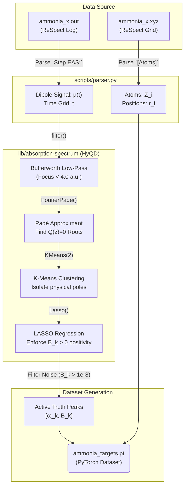
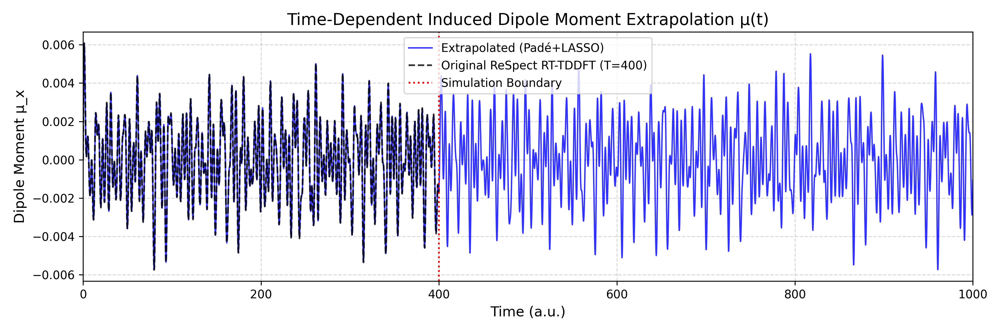

# Data Extraction Pipeline & HyQD Library Reference
> **Architecture mapping for the RT-TDDFT to PyTorch Dataset Pipeline**

This document serves as the technical reference for how we utilize the cloned `HyQD/absorption-spectrum` repository and wrap it into our local pipeline to construct deterministic Machine Learning targets.

## 1. The Pipeline Architecture

The script `scripts/extract_peaks.py` acts as the bridge between raw computational chemistry logs (ReSpect) and PyTorch geometric deep learning logic.



## Dipole Extrapolation Physics
By extracting the variables above, we mathematically define the infinite time-limit of the response:


*(The exact induced dipole signal from ReSpect, matched natively by our extracted LASSO poles and infinitely extrapolated past $t=400$ a.u.)*

## 2. Key Library Dependencies (HyQD)
The repository `lib/absorption-spectrum` (Hauge et al. 2023) is initialized locally via the `BroadbandDipole` class. Here is how our system interacts with it:

- **`spectra.dipole.BroadbandDipole`**: The main interface. We initialize it with `cutoff_frequency=4.0` (atomic units) to drop ultra-high energy non-valence excitations.
- **`fit(dipole_moment, time_points)`**: The master method that runs the entire sequence. 
  1. Calculates `reduction` ratio based on `max_points_pade`.
  2. Extracts mathematical poles in the complex plane.
  3. Clusters to find true `frequencies` $\omega_k$.
  4. Formulates a sparse sequence matrix and executes scikit-learn's `Lasso` to extract pure positive `B` coefficients.

## 3. What You Need to Run This
To extract new molecules in the future, simply ensure the directory structure matches the following exactly:

```text
data/raw/
  ├── molecule_name_x/
  │   ├── rvlab.tdscf.out   (or molecule_name.out)
  │   └── rvlab.tdscf.xyz
```
Run `python scripts/extract_peaks.py` and point it at the directory. The physics extractor handles the rest and yields your `.pt` training dataset automatically!

## 4. Diagnostics & Troubleshooting
If `extract_peaks.py` reports `Extraction Warning (Validation Error > Tol)!`, the LASSO pipeline failed to perfectly reconstruct the continuous signal back from the extracted peaks.
- **Solution 1:** Check if `unstable_cycles` or the `alpha` penalty modifier inside the HyQD `Lasso` optimizer is pruning real peaks.
- **Solution 2:** Render the complex roots via our `dashboard/app.py` Complex Pole Mapping diagnostic tab to visually inspect if the K-Means algorithm successfully detected the unit-circle edge.